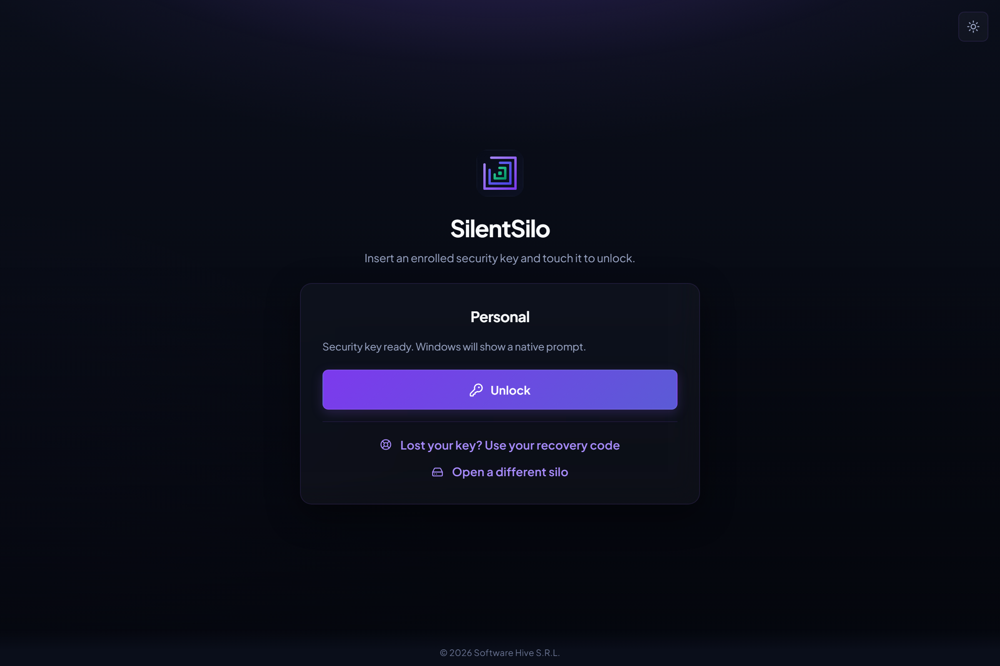
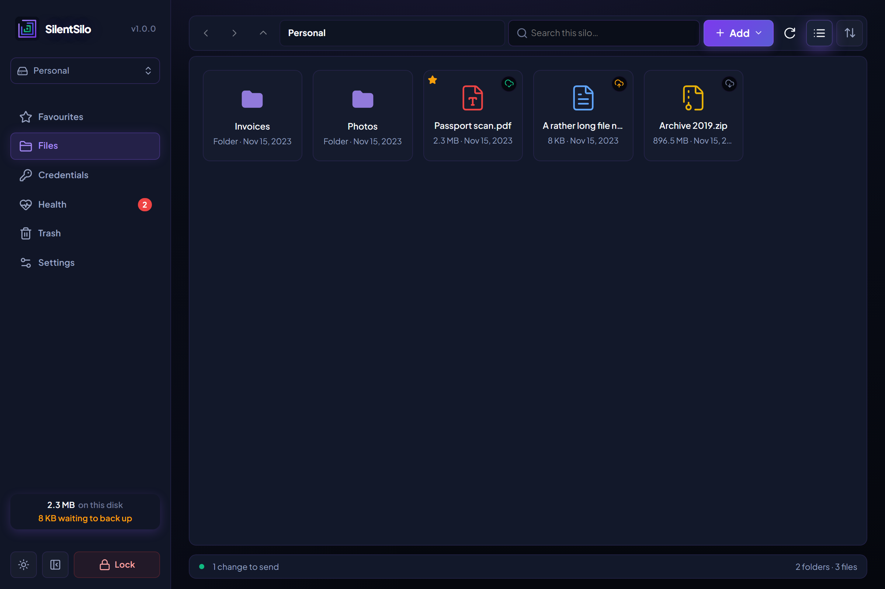
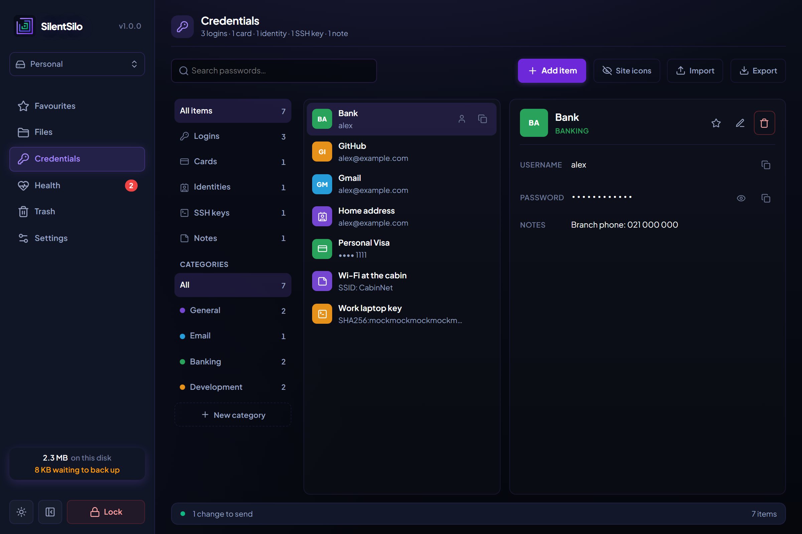
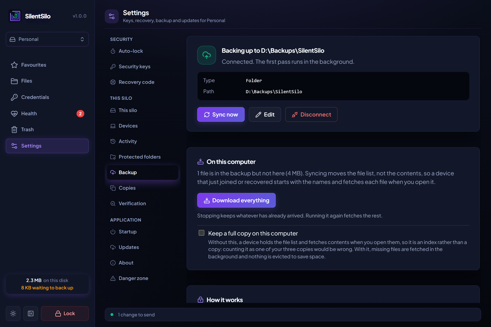

# SilentSilo

Zero-knowledge, end-to-end encrypted vault for files and passwords, unlocked
by a FIDO2 security key or Windows Hello, with a written-down recovery code
as the fallback. AGPL-3.0.

Everything runs locally: no account, no server. Backup to an S3-compatible
bucket you control is optional; the provider only ever sees ciphertext.

Every feature is in every copy. There is no paid tier, no licence key and
nothing held back. Hosted storage is sold separately for people who would
rather not run a bucket themselves, and the app works the same without it.

> **No independent security audit has been done.** Nobody outside this
> project has been paid to attack it. The cryptography is specified in
> [`docs/CRYPTO.md`](docs/CRYPTO.md), the formats in [`FORMATS.md`](FORMATS.md),
> the threat model and its limits are published, and all of this is readable
> here. That makes the design reviewable; it is not the same as an audit, and
> a serious flaw could sit in code that looks right and passes its tests.
> Weigh that before trusting it with something whose disclosure would be
> severe for you. When an audit happens it will be published, findings
> included.

## What it looks like

| Unlocking, with a security key | The files in a silo |
|---|---|
|  |  |

| Credentials | Backup, to storage you chose |
|---|---|
|  |  |

## Stack

- Tauri 2 · Rust 1.97 · React 19 · Vite

## Crates (Rust workspace)

| Crate | Role |
|-------|------|
| `silentsilo-crypto` | AES-GCM streaming, envelope encryption |
| `silentsilo-vault` | Local vault provisioning; `vault.db` encrypted at rest (AES-256-GCM) |
| `silentsilo-vfs` | Folder/file tree |
| `silentsilo-fido` | FIDO2 security keys and Windows Hello |
| `silentsilo-s3` | S3-compatible object storage client |
| `silentsilo-store` | Backup storage: bucket, folder, WebDAV or SFTP |
| `silentsilo-sync` | Multi-device sync over whichever of those |
| `silentsilo-shell` | Explorer/Finder context menu |

## Silos

One install can hold several (personal, family, work). Each is a folder you
choose the location of, holding its own encrypted index, blobs, security-key
envelopes and credentials. Nothing is shared between them but the app, which
keeps only an index of where they are; losing that index costs you the list,
not the data.

Because everything a silo needs is inside its folder, a silo can live on an
external drive, be copied to another machine, or be restored from a backup as
a unit. Nothing decrypted is ever written there: the working copy lives in a
machine-local directory and is wiped when the silo locks. A silo folder is
therefore safe to put anywhere, including a folder a cloud client is syncing.

That last case works as a backup for **one** computer. It cannot serve two:
the encrypted snapshot is a single file rewritten on every change, so two
machines editing it produce a conflict copy rather than a merge. Sharing a
silo between computers is what the operation log in a bucket is for.

## Unlocking

Three ways in, all of which end up handing the vault the same encryption key:

| Method | Strength | Survives the machine |
|--------|----------|----------------------|
| FIDO2 security key | `hmac-secret` on the key | Yes, carry it with you |
| Windows Hello | same, held in the TPM | No, sealed to that PC |
| Recovery code | 160 generated bits | Yes, it's on paper |

There is deliberately **no passphrase option**. The vault is only as strong as
its weakest envelope, and a memorable phrase is around forty bits. Allowing
one would quietly make it the real security of the whole design, particularly
since envelopes are published to the bucket so other devices can join.

## Optional backup and multi-device sync

Point the app at any S3-compatible bucket you control (AWS, Backblaze B2,
Cloudflare R2, Wasabi, MinIO, …) and it will keep itself in step with your
other devices. There is no server in the middle and nothing to sign up for:
the bucket is yours, and everything in it is ciphertext except a small
manifest naming a random vault id.

Sync is optional. A vault that never connects storage stays fully local and
fully usable.

Devices reconcile through an append-only log of operations. Every change is
one immutable object, so a push is always a create: no conditional writes,
no locking, and nothing that depends on a provider feature beyond plain
PUT/GET/LIST/DELETE. Devices that have been offline converge on the same
tree regardless of the order records arrive in.

To join a second device, pick *I already have a vault* on first run, point it
at the same bucket, and touch a security key already enrolled on the first.
Its tree is rebuilt by replaying the log. There is no snapshot to download,
and no step where anything is readable in transit.

## Dev

```bash
npm install
npm run tauri:dev
```

### Integration tests

The sync and storage tests run against a real server, and skip unless one is
configured:

```bash
docker run -d --name silentsilo-minio -p 9100:9000 -e MINIO_ROOT_USER=silentsilo -e MINIO_ROOT_PASSWORD=silentsilo123 minio/minio server /data
```

Create a `vault-test` bucket, then:

```bash
SILENTSILO_TEST_S3_ENDPOINT=http://127.0.0.1:9100 cargo test -p silentsilo-s3 -p silentsilo-sync
```

### Platform notes

Security-key access uses a different backend per OS (both are real, working
implementations, neither a stub):

| OS | Backend | Notes |
|----|---------|-------|
| Windows | OS WebAuthn API (`webauthn.dll`) | No administrator rights required. |
| Linux / macOS | CTAP2 over USB HID (`ctap-hid-fido2`) | Linux typically needs `libudev-dev` and `libusb-1.0-0-dev` (or your distro's equivalents) installed to build the HID dependencies. |

Building with `--no-default-features` disables the `hardware` feature on
`silentsilo-fido` entirely (useful for CI/lint-only environments without HID
libs available). The app then falls back to a stub backend where no
security-key operation succeeds, so don't use it for a real build.

## Known gaps

See [BACKLOG.md](BACKLOG.md) for what is deliberately unfinished. No
independent security audit has been done, as the note at the top says. The
dependency licences have not been audited against AGPL-3.0 either, and there
is no licensing code. Log compaction, blob
garbage collection, key rotation, conflict copies, silo verification, the
printable emergency kit and the standalone extraction tool are all done.

## Docs

Crypto specification (public): [`docs/CRYPTO.md`](docs/CRYPTO.md)

Setting up storage that survives a bad day, including append-only targets,
object lock, and the lifecycle rule that deletes your archive:
[`docs/STORAGE.md`](docs/STORAGE.md)

Persisted formats, their versions, and what an older build does when it meets
a newer one: [`FORMATS.md`](FORMATS.md)
