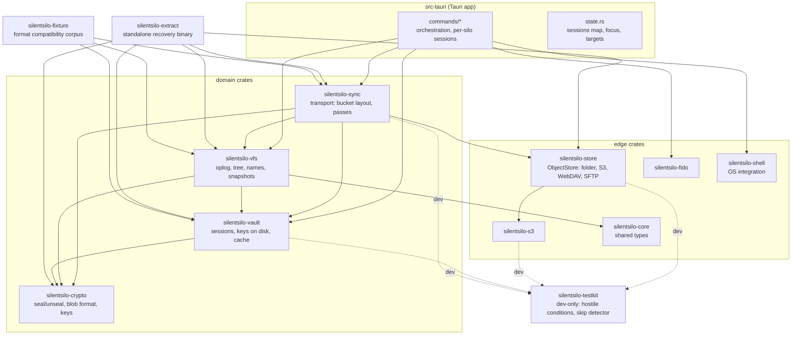
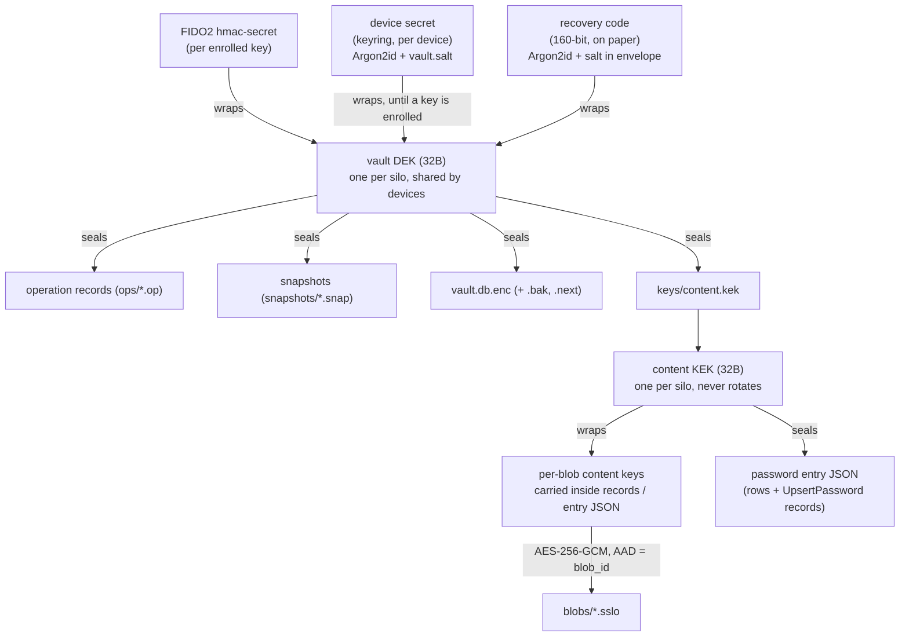
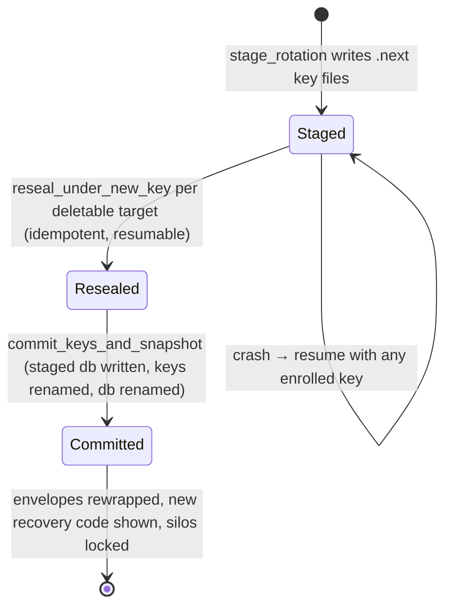
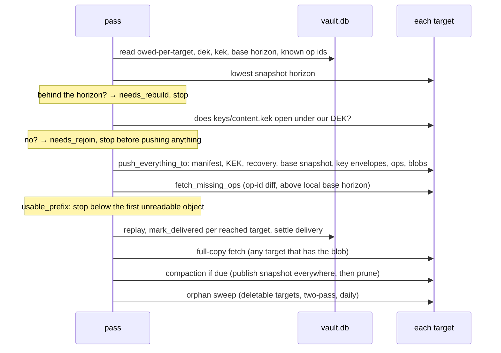
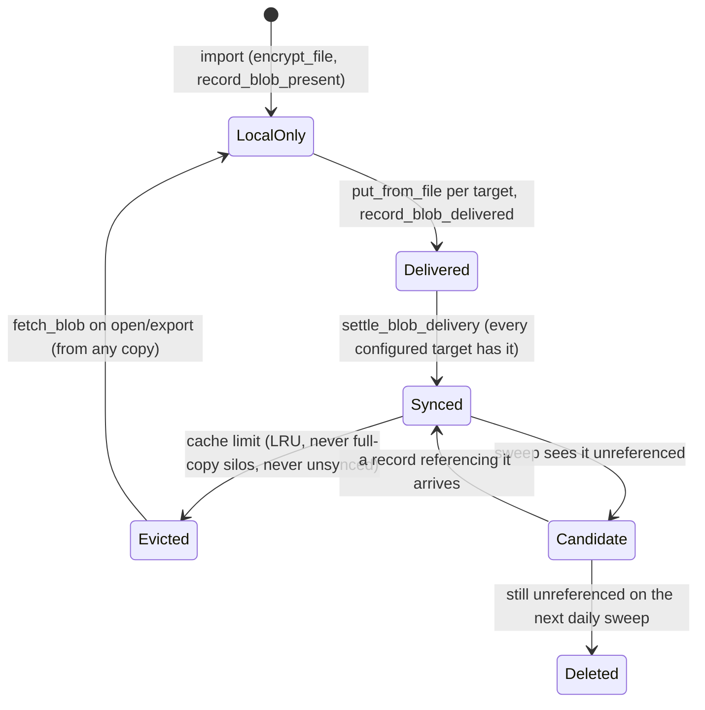
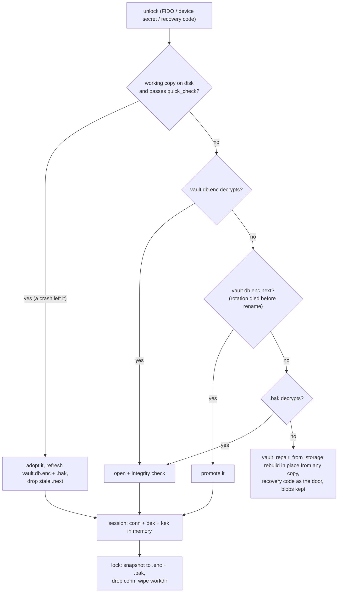

# Architecture map

The working map of how SilentSilo fits together: the flows, the invariants
every change has to preserve, and the decisions that look wrong until you
know why they are there. Written for whoever changes this code next, human
or tool. The other documents each own one slice: [FORMATS.md](../FORMATS.md)
owns the persisted bytes, [CRYPTO.md](CRYPTO.md) owns the cryptography as an
auditor reads it, [STORAGE.md](STORAGE.md) speaks to users, and
[ORGANISATIONS.md](ORGANISATIONS.md) is IT procedure. This page owns the
moving parts and the reasoning.

**Keep it true.** A change that alters anything described here updates this
page in the same commit. A stale map is worse than none: it answers with
confidence and it answers wrong.

## The one-paragraph model

SilentSilo is a local-first encrypted vault. There is no server. Every
change to the tree is an immutable, encrypted operation record appended to a
log; devices converge by exchanging records through dumb storage the user
owns (S3, WebDAV, SFTP, a folder). File content lives beside the log as
encrypted blobs, each under a key of its own. Everything a device shows is a
disposable cache rebuilt from the log; the log and the blobs are the only
things that matter, and the whole design bends around never losing either.

## Crate map

Dependency direction is the rule worth defending: `silentsilo-sync` is
transport and knows no UI; `silentsilo-vfs` owns the model and knows no
network; `silentsilo-crypto` knows nothing above bytes. The extract binary
deliberately reuses the same crates rather than reimplementing the read
path: a second interpretation of the log is a second thing that can be
wrong.

## Key hierarchy

Why two layers under the DEK: a record's fingerprint covers its body, so
nothing inside a record can ever be rewritten. Content keys therefore hide
behind the KEK, and rotating the vault key re-wraps one KEK envelope plus
the DEK envelopes, touching no record and no blob. That is what makes
rotation affordable on a terabyte. The KEK itself never rotates; the DEK
does. Password entries seal under the KEK for the same reason: the
ciphertext travels inside records.

Rotation state machine (`silentsilo-vault/rotation.rs`, driven from
`commands/fido.rs`):

The order is forced: the staged key is durable on disk before any object in
storage is re-sealed, because an object under a key that existed only in
memory is one nothing opens. Going backwards is never attempted; a second
rotation cannot be staged over a pending one. A device that was not kept in
the rotation is detected on its next pass, before it pushes: the published
KEK envelope only opens under the current DEK, and `key_still_current` turns
that into `needs_rejoin`. Without that gate, the stale device pushed records
nobody could read and overwrote the rotated KEK envelope with its own.

## Data at rest

Three distinct places, and the boundary between them is a security
property:

- **The silo folder** (user-chosen, portable, safe in a synced directory):
  only ciphertext. `vault.db.enc` and `.bak` (the index, sealed under the
  DEK), `vault.db.enc.next` (mid-rotation only), `blobs/*.sslo`,
  `vault.salt`, `master.dek.enc`, `keys/` (fido.json, recovery.json).
  Every irreplaceable file here is written atomically, temp then sync then
  rename (`workdir::write_private`), and a blob is synced to disk before the
  import returns: the record naming it can reach the bucket within seconds,
  and a truncated key file or a hollow blob after a power cut is a lockout
  or a permanently unopenable file.
- **The machine workdir** (keyed by silo path, outside the folder): the
  plaintext working copy `vault.db` with its WAL, decrypted files the user
  opened (`open/`), and `cache.db` (blob bookkeeping). Wiped on lock;
  adopted on unlock after a crash. Nothing here may ever land in the silo
  folder, or a silo in Dropbox uploads its index in the clear.
- **The bucket** (per target): `vault.json` (the only plaintext object, one
  random UUID), `ops/`, `blobs/`, `snapshots/`, `keys/*.env`,
  `keys/content.kek`, `recovery.env`. Layout and versions are FORMATS.md's
  jurisdiction.

Object keys sort meaningfully: op keys are
`ops/{lamport:020}-{device_id}-{op_id}.op`, so a plain listing is already in
apply order and both the Lamport value and the op id can be read without
downloading. Snapshot keys are the zero-padded horizon. Only `blobs/` keys
are immutable-by-key; everything else may be rewritten in place (rotation
re-seals, envelopes re-wrap), which is why seeding size-skips blobs alone
and copies the rest unconditionally.

## The operation log

State is a pure function of the record set. The total order is
`(lamport, device_id, op_id)`; replay sorts, so arrival order is
irrelevant. Alongside the Lamport value every record carries `seq` and
`prev`: a per-device hash chain that makes silently dropped or replaced
records detectable (`verify_chains`; see the gotchas for why it is not
wired). `emit` runs local changes through the same `apply_op` as remote
ones, inside one transaction with the Lamport reservation and the log row,
so the write path cannot drift from the replay path and a crash cannot
leave an effect without its record.

Name resolution is the subtle part. Uniqueness is per folder,
case-insensitive and Unicode-composed (`names::fold`). The `name_claims`
table records which operation claimed which name; ranks within a claim
group assign `name`, `name (2)`, and so on, as a pure function of the
record set. Typed names are validated (`names::check`) and NFC-composed at
the boundary; replayed names are repaired (`names::sanitize`) because a
record can never be refused. Concurrent edits of one file resolve by total
order, with the loser preserved as a deterministic conflict copy (id
derived from the losing record via UUIDv5, carrying the losing content's
wrapped key).

### Sync pass anatomy

`commands/sync.rs::run_sync_pass`, in this exact order, each step placed
for a reason:

- **Push before pull**: a record that exists only locally has no other
  copy anywhere; it goes out before anything else can go wrong.
- **Fetch diffs op ids against the listing**, never a Lamport watermark: a
  device that was offline pushes records below everyone's high-water mark,
  and a watermark skips them forever (then compaction deletes them from the
  bucket, which is how a file vanishes silently). The local base horizon is
  the one lower bound that stays: records at or below it are covered by the
  base snapshot and must never be re-applied.
- **Unreadable objects hold back, not wedge**: replay stops below the first
  unreadable Lamport value, because applying past a hole turns the missing
  record's dependents into `Obsolete`, which is permanent. The rest of the
  silo keeps syncing; the objects are reported and retried.
- **Ops before blobs on push, and on the same push**: a visible file whose
  content has not arrived self-corrects next pass; content with no record
  looks like an orphan and gets swept. Same reasoning gives the join order
  in `push_everything_to` (identity first, snapshot before log, content
  last).
- **Delivery accounting is per target** (`op_delivery`, `blob_delivery`):
  `pushed`/`synced` mean "every configured target has it", which is the only
  meaning that makes local pruning and eviction safe. Removing a target
  drops its rows; a target added later is owed everything, including
  history.

### Compaction

A snapshot at a chosen Lamport horizon stands in for every record at or
below it. `choose_horizon` keeps a time margin (30 days, from untrusted
timestamps) and a count margin (500 records, which holds when a clock
lies), never splits a Lamport value, and only the device that has just
synced everything may compact. Order, one way only: capture, publish the
snapshot to every target, read it back and refuse to prune unless the bytes
in storage are the bytes written (it is about to become the only copy of
everything below the horizon), delete covered ops from targets that allow
it, prune locally (unpushed records are never dropped and are reported as
stranded). A device that falls below the horizon gets `needs_rebuild` and
comes back via the snapshot with a fresh device id, because its old chain
positions died with the log. Append-only targets keep their whole log and
still receive the snapshot, which is what a joining device replays from.

## Blob lifecycle

The referenced set is `files.blob_id` (trash included, a restore needs the
bytes) plus password attachment blobs parsed out of the decrypted entries,
because attachments have no row anywhere; the sealed entry is their only
reference (`Vfs::referenced_blobs_with_attachments`). Purge and attachment
removal clean the local cache only; the bucket copy is always the sweep's
to delete, because the sweep re-asks after the ops have converged, and a
row written concurrently on another device may still need the bytes. All
transfers stream through disk (`put_from_file`/`get_to_file`); nothing
holds a whole blob in memory.

## Session and lock lifecycle

The working copy wins over the snapshot because it exists only after a
crash (lock wipes it) and holds everything since the last lock. Up to three
silos stay open (`MAX_OPEN_SILOS`), least-recently-used evicted; every way
in funnels through `open_focused_session`. Long operations snapshot the
session's cheap parts (`SessionSnapshot`) and take the sessions mutex only
per row, never across encryption or network work; they pin the silo id they
started on rather than re-reading focus.

## Recovery matrix

What gets someone out of which hole, all of it built from the same pieces
(`fetch_join_plan` picks snapshot-plus-tail or whole log by asking the
bucket):

| Situation | Way out |
|---|---|
| Lost the security key, machine fine | `vault_unlock_with_recovery` (code, local or bucket envelope) |
| Machine gone entirely | `vault_join_with_recovery`, or a key on a new machine via `vault_join_from_storage` |
| Machine gone, project gone | `silentsilo-extract`: files, trash to one side, passwords as CSV, attachments |
| Local index corrupt beyond both snapshots | `vault_repair_from_storage`, offered by the unlock screen, in place, blobs kept |
| Device below the compaction horizon | `vault_rebuild_from_snapshot` (any copy that holds one), fresh device id |
| Device rotated away | `needs_rejoin`: remove and rejoin with a current credential |
| Bit rot in a copy | `vault_verify` deep read; a damaged object re-uploads from another copy or the local cache on later passes |

## Looks wrong, is deliberate

Read this before "fixing" any of it.

- **`verify_chains` is never called.** Wiring it naively false-positives on
  every rebootstrapped device, whose new chain legitimately starts above
  zero from the fetcher's point of view. It waits for a checkpoint design.
- **`derivation` on key envelopes looks unused.** It is groundwork for
  platform authenticators on mobile (Secure Enclave, TPM) and every device
  reads every other device's envelopes. Do not prune.
- **Purge does not delete bucket blobs.** The sweep does, two-pass, after
  convergence. Deleting at purge time froze "referenced" at what one device
  knew and destroyed content another device still pointed at.
- **Seeding size-skips only `blobs/`.** Everything else is rewritten in
  place at identical length by rotation, so "same key, same size" would
  skip the one write that matters.
- **S3 HEAD treats 403 as absent.** A prefix-scoped credential gets 403 for
  a missing key; callers use HEAD to decide whether to write, writes are
  idempotent, and a genuinely bad credential fails loudly on PUT.
- **`SetDeviceLabel` and `AnnounceDevice` are separate ops** so a machine
  re-announcing its hostname can never overwrite a name a person typed.
  Empty label means "no label", deliberately.
- **`settle_delivery([])` marks everything unpushed.** No targets means no
  copy holds anything, and compaction must not prune on the strength of
  copies that no longer exist. Same shape for blobs.
- **`fetch_blob` does not mark the blob evictable** even though it plainly
  came from a target: eviction needs every target to hold it and this call
  knows only one. The next pass settles it.
- **`is_skippable` is a per-variant decision**, carried on the record,
  because it is all an older build has to go on when it meets an operation
  from a newer one. Decoration skips; structure refuses.
- **`MAX_OP_BYTES` rejects from the listing**, before download: storage is
  untrusted and an object sized to exhaust memory must never be fetched.
  Same posture as the Argon2 parameter ceiling on `recovery.env`.
- **Recovery codes map O→0, I/L→1, U→V on input.** Crockford's alphabet
  excludes those on output precisely because handwriting confuses them;
  strict parsing would reject correct codes.
- **The desktop app is free and stays that way; wording is accountability,
  never warranty.** Every copy change goes through that filter.

## Changing things

The checklist, in order:

1. **Does it touch a persisted format?** The list is in FORMATS.md, and the
   question to answer is what the previous release does with the new bytes.
   Pre-launch there are no previous releases, so no compatibility code and
   no migration paths; the discipline still applies to the *shape* (version
   fields exist before launch so they can do their job after).
2. **Does it change what replay produces?** Then every device must produce
   the same result from the same records, in any order, and a test proving
   both orders belongs next to the change. `SCHEMA_VERSION` stays at 1
   until a post-launch change needs a rebuild; bumping it pre-launch is
   migration work for installs that do not exist.
3. **Does it touch delivery, eviction, sweeping or compaction?** State the
   invariant it preserves: nothing is marked sent before storage confirms;
   nothing local is dropped unless every copy holds it; nothing in a bucket
   is deleted unless it is covered by a snapshot or unreferenced across two
   sweeps.
4. **Run the whole CI sequence locally, from the workspace root**, in the
   order `.github/workflows/ci.yml` runs it. The cargo commands need
   `--all` from the root or they silently skip crates. Add
   `cargo test -p silentsilo-fixture` when replay or formats moved: a
   fixture whose decoded output changes is a break, not a fixture to
   update.

   Anything touching a storage backend goes through
   `scripts/test-local.ps1`, which brings up MinIO, WebDAV and SFTP in
   containers and runs the same sequence with the endpoints set. Those
   suites skip themselves without an endpoint, so on a developer machine
   they otherwise never run at all: the streaming transfers, the S3 client
   and the multi-device sync tests were exercised only by CI, after a push.
   That script sets `SILENTSILO_TEST_REQUIRE_BACKENDS`, which turns
   `silentsilo_testkit::skip_or_fail` from a printed line into a failure:
   a suite that skips itself during a run that asked for it is a hole, not
   a note.
5. **Does it change a write the app cannot afford to lose?** Then it
   belongs in `silentsilo-vault/tests/hostile_environment.rs`, which runs
   each of those writes with something holding the destination open and
   with the temp path blocked. A clean temporary directory is not the
   machine the app runs on: the worst defect found so far was a
   temp-then-rename that a scanner's open handle refused, and no test in
   the suite held anything open.
6. **Update this page and FORMATS.md in the same commit** when behavior
   they describe moves.
