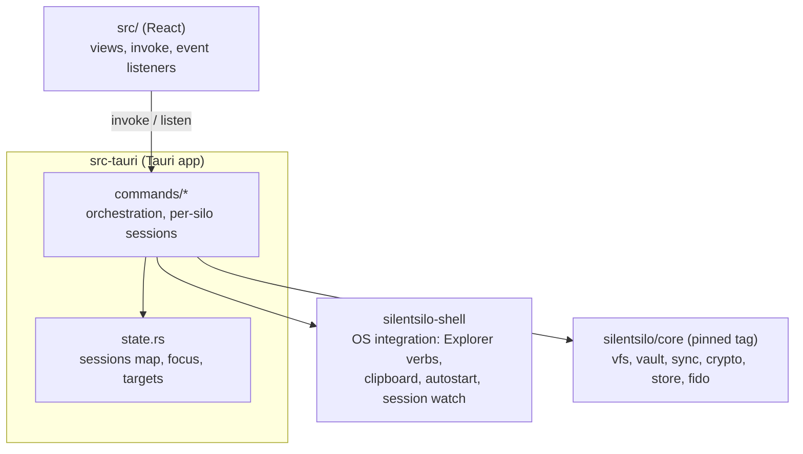
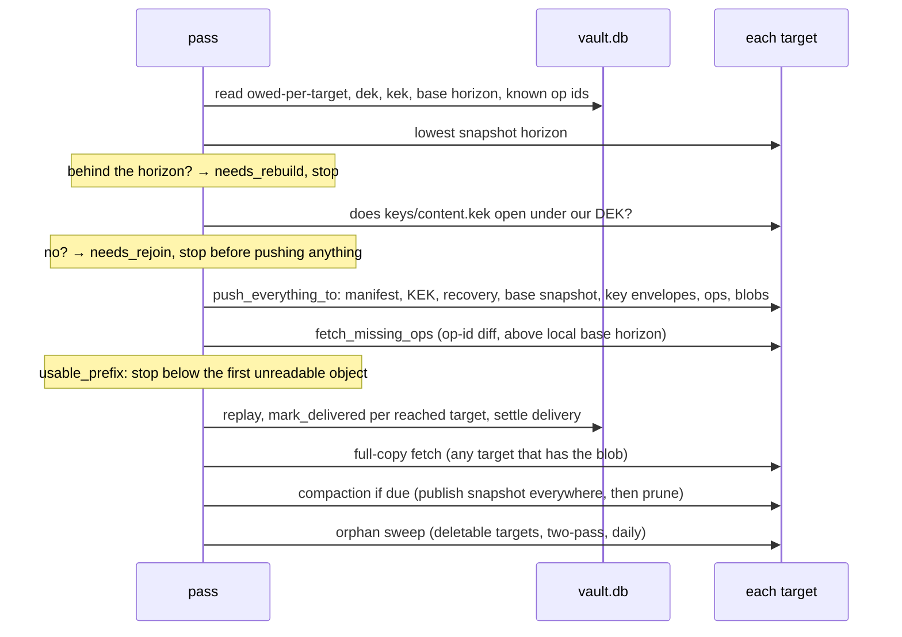
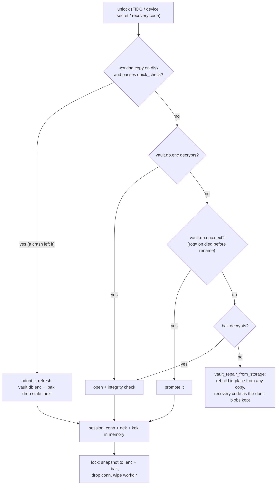

# Architecture map (desktop)

The working map of the desktop application: how a silo is opened, held and
closed, and the order a sync pass runs in. Written for whoever changes this
code next, human or tool.

Everything below the application lives in
[silentsilo/core](https://github.com/silentsilo/core): the key hierarchy, the
persisted formats, the operation log, compaction, the blob lifecycle and the
recovery matrix. Read that map first when a change touches sync, the vault,
crypto, the oplog or blobs. This repository pins a core tag in
`Cargo.toml`, and moving that pin is the moment the two are tested together.

The other documents each own one slice: [STORAGE.md](STORAGE.md) speaks to
users, [ORGANISATIONS.md](ORGANISATIONS.md) is IT procedure. This page owns
the application's moving parts.

**Keep it true.** A change that alters anything described here updates this
page in the same commit. A stale map is worse than none: it answers with
confidence and it answers wrong.

## Shape

The application is the only layer that knows there is a window. It owns the
flows (unlock, enrol, join, rotate, recover, import, export), the per-silo
session map and the event names the frontend listens to. `silentsilo-shell`
is the only crate here that talks to the operating system, and it is the one
a port to another desktop platform rewrites.

The 107 commands are the whole contract with the frontend, along with their
parameter names, their event names and payload shapes, and the error strings
`src/lib/errors.ts` matches on. None of those may change without changing
the frontend in the same commit.

## Sync pass anatomy

`commands/sync.rs::run_sync_pass`, in this exact order, each step placed
for a reason:

- **Push before pull**: a record that exists only locally has no other
  copy anywhere; it goes out before anything else can go wrong.
- **Fetch diffs op ids against the listing**, never a Lamport watermark: a
  device that was offline pushes records below everyone's high-water mark,
  and a watermark skips them forever (then compaction deletes them from the
  bucket, which is how a file vanishes silently). The local base horizon is
  the one lower bound that stays: records at or below it are covered by the
  base snapshot and must never be re-applied.
- **Unreadable objects hold back, not wedge**: replay stops below the first
  unreadable Lamport value, because applying past a hole turns the missing
  record's dependents into `Obsolete`, which is permanent. The rest of the
  silo keeps syncing; the objects are reported and retried.
- **Ops before blobs on push, and on the same push**: a visible file whose
  content has not arrived self-corrects next pass; content with no record
  looks like an orphan and gets swept. Same reasoning gives the join order
  in `push_everything_to` (identity first, snapshot before log, content
  last).
- **Delivery accounting is per target** (`op_delivery`, `blob_delivery`):
  `pushed`/`synced` mean "every configured target has it", which is the only
  meaning that makes local pruning and eviction safe. Removing a target
  drops its rows; a target added later is owed everything, including
  history.

## Session and lock lifecycle

The working copy wins over the snapshot because it exists only after a
crash (lock wipes it) and holds everything since the last lock. Up to three
silos stay open (`MAX_OPEN_SILOS`), least-recently-used evicted; every way
in funnels through `open_focused_session`. Long operations snapshot the
session's cheap parts (`SessionSnapshot`) and take the sessions mutex only
per row, never across encryption or network work; they pin the silo id they
started on rather than re-reading focus.

## Looks wrong, is deliberate

Read this before "fixing" any of it. The gotchas that live in the domain
crates are in core's map.

- **The desktop app is free and stays that way; wording is accountability,
  never warranty.** Every copy change goes through that filter.

## Changing things

The checklist, in order:

1. **Does it touch anything in core?** Then it is a change in the other
   repository, released as a tag, and this one moves its pin afterwards.
   Nothing about a persisted format can be changed from here.
2. **Does it change a command, a parameter name, an event or an error
   string?** All four are contracts with the frontend. Command and parameter
   names are matched by string and fail silently when renamed; event payload
   shapes are read by field; `src/lib/errors.ts` matches on substrings of
   Rust error messages. Change the frontend in the same commit.
3. **Does it change the session or lock lifecycle?** State the invariant it
   preserves: a lock leaves no decrypted working copy behind, the snapshot is
   written before the session is dropped, and every open silo is flushed on
   exit, not just the focused one.
4. **Run the whole CI sequence locally, from the workspace root**, in the
   order `.github/workflows/ci.yml` runs it, with `--locked` on every cargo
   command. `--locked` is what catches a `Cargo.lock` left patched at a local
   core checkout.
5. **Does it change a flow the tests cannot reach?** The security key, the
   Explorer verbs, the tray and autostart have no automated coverage. Say in
   the commit message what you exercised by hand.
6. **Update this page in the same commit** when behavior it describes moves.
