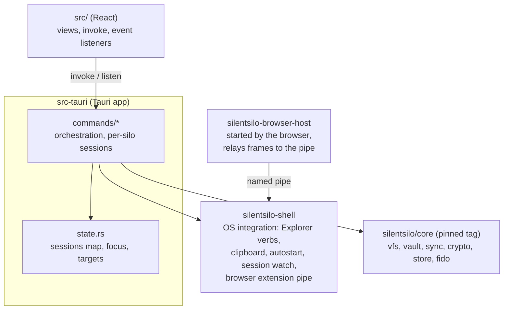
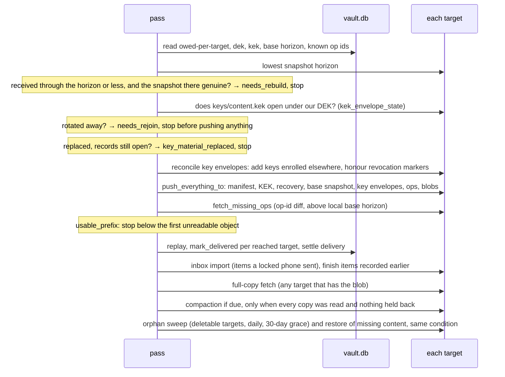
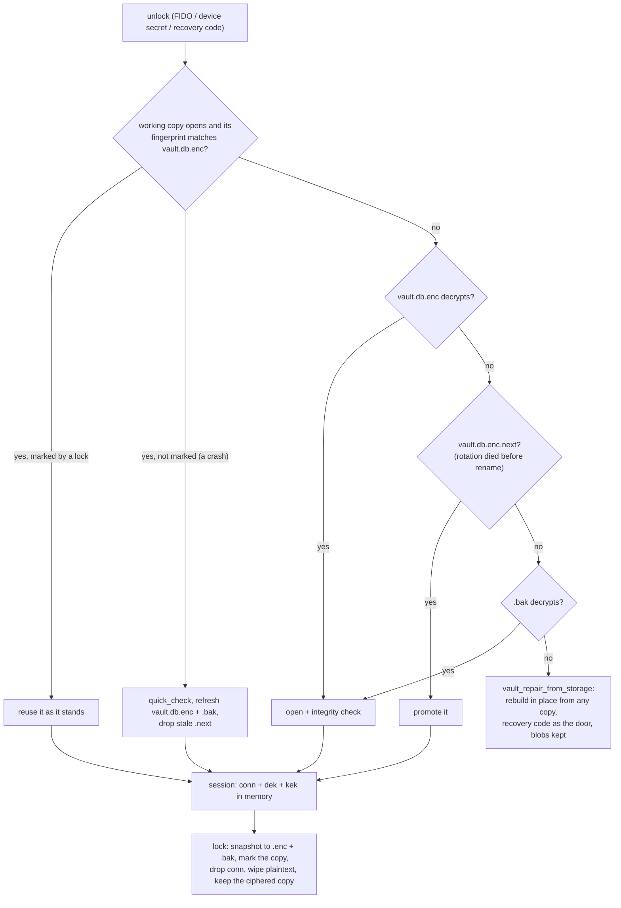
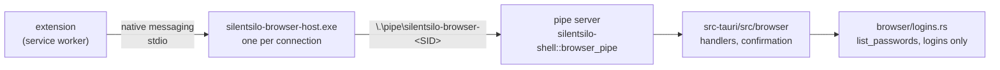

# Architecture map (desktop)

The working map of the desktop application: how a silo is opened, held and
closed, and the order a sync pass runs in. Written for whoever changes this
code next, human or tool.

Everything below the application lives in
[silentsilo/core](https://github.com/silentsilo/core): the key hierarchy, the
persisted formats, the operation log, compaction, the blob lifecycle and the
recovery matrix. Read that map first when a change touches sync, the vault,
crypto, the oplog or blobs. This repository pins a core tag in
`Cargo.toml`, and moving that pin is the moment the two are tested together.

The other documents each own one slice: [STORAGE.md](STORAGE.md) speaks to
users, [ORGANISATIONS.md](ORGANISATIONS.md) is IT procedure. This page owns
the application's moving parts.

**Keep it true.** A change that alters anything described here updates this
page in the same commit. A stale map is worse than none: it answers with
confidence and it answers wrong.

## Shape

The application is the only layer that knows there is a window. It owns the
flows (unlock, enrol, join, rotate, recover, import, export), the per-silo
session map and the event names the frontend listens to. `silentsilo-shell`
is the only crate here that talks to the operating system, and it is the one
a port to another desktop platform rewrites.

The 114 commands are the whole contract with the frontend, along with their
parameter names, their event names and payload shapes, and the error strings
`src/lib/errors.ts` matches on. None of those may change without changing
the frontend in the same commit.

**No command runs on the main thread.** Tauri puts a plain
`#[tauri::command] fn` on the thread that owns the window and pumps its
messages, so anything that command waits for is a window that stops
redrawing and stops taking clicks. Every command here is either an `async
fn` or carries `#[tauri::command(async)]`, which is why commands that borrow
`State<'_, AppState>` all return `Result`. The waits are not hypothetical:
the sessions mutex is held across a replay, the keyring and DPAPI are a
round trip per stored target, and the clipboard is taken by sleeping between
retries. The handful with no bound at all (`app_bootstrap` enumerating
authenticators, `full_copy_status` walking the blob directory, `sync_status`
and `backup_targets_list` polled while a pass holds the lock,
`copy_secret_to_clipboard`) go further and run their body through
`run_blocking`, so they occupy a pool thread rather than one of the async
runtime's workers, which is where the sync pass's network work lives.

## Sync pass anatomy

`commands/sync.rs::run_sync_pass`, in this exact order, each step placed
for a reason:

- **Push before pull**: a record that exists only locally has no other
  copy anywhere; it goes out before anything else can go wrong.
- **Fetch diffs op ids against the listing**, never a Lamport watermark: a
  device that was offline pushes records below everyone's high-water mark,
  and a watermark skips them forever (then compaction deletes them from the
  bucket, which is how a file vanishes silently). The local base horizon is
  the one lower bound that stays: records at or below it are covered by the
  base snapshot and must never be re-applied.
- **Unreadable objects hold back, not wedge**: replay stops below the first
  unreadable Lamport value, because applying past a hole turns the missing
  record's dependents into `Obsolete`, which is permanent. The rest of the
  silo keeps syncing; the objects are reported and retried. A record that
  opens but sits under another record's name is a copy storage made, and is
  skipped.
- **Compaction and the sweep need the whole picture**: both act on what
  this device believes is referenced, so a pass with a record held back, an
  unreadable object, or a copy it could not read runs neither. The same
  complete passes record `received_through`, the highest Lamport value
  storage listed, which is what the horizon check compares against: the
  highest local record counts this device's own writes and hid a device
  that wrote a lot offline.
- **The sweep waits 30 days and puts content back**: a candidate is deleted
  only when an earlier sweep saw it unreferenced and this device first saw
  that 30 days ago (`blob_gc_seen`). A device that has not synced can still
  move a file over content the others stopped referencing. The same listing
  uploads content a row here points at and the target lacks, from the cache
  or another copy (`silentsilo_sync::restore_missing_blobs`), counted in
  `blobs_restored`. Content no row references is never sent, so emptying the
  trash is not undone. The same daily sweep aborts unfinished S3 uploads
  older than 24 hours under `blobs/`, `snapshots/` and `inbox/`
  (`silentsilo_sync::abort_stale_uploads`); a failure there is a warning and
  the sweep carries on. The step matches core's `silentsilo-app` pass.
- **Ops before blobs on push, and on the same push**: a visible file whose
  content has not arrived self-corrects next pass; content with no record
  looks like an orphan and gets swept. Same reasoning gives the join order
  in `push_everything_to` (identity first, snapshot before log, content
  last).
- **Keys reconcile before the push**: a device learns keys other devices
  enrolled, and a revocation leaves a sealed marker the others honour.
  Publishing first would put back a key another device just revoked. A
  tombstone is dropped only once its marker is in storage. The step is
  core's `silentsilo_sync::reconcile_key_envelopes`, run the same way as in
  `silentsilo-app`.
- **A content key that will not open is two different things**, and
  `kek_envelope_state` reads the records beside it to tell them apart. If
  they do not open either, the silo's key was rotated and this device was
  not kept: `needs_rejoin`, and the screen says to rejoin. If they still
  open, no rotation produced that state, because a rotation re-seals the
  records first and writes this object last. The object was replaced or put
  back from an older copy, so the pass reports `key_material_replaced` and
  the screen says the storage is what has to be fixed. Rejoining fetches the
  same object and fails on it, which is why the two must never share a
  message.
- **The inbox imports after the push and pull**: an item recorded in one
  pass leaves the inbox only in a later pass that reached every target, so
  it is never gone from storage while its record exists on this machine
  alone. With more than one target the content is fetched down for the next
  push to spread. Core's `silentsilo_app::inbox_import`, fed this app's
  session map without touching idle timers.
- **Delivery accounting is per target** (`op_delivery`, `blob_delivery`):
  `pushed`/`synced` mean "every configured target has it", which is the only
  meaning that makes local pruning and eviction safe. Removing a target
  drops its rows; a target added later is owed everything, including
  history. Core's `mark_delivered` writes the whole list under a savepoint,
  which nests inside the transaction this pass wraps the per-target loop in,
  so one commit covers every target: a target owed a long history used to pay
  for a commit per record with the sessions mutex held. A delivery that does
  not commit leaves the records owed, which the next pass settles by finding
  them already in storage.
- **A pass reports bytes as well as items**: `sync-progress` carries
  `bytes_done` and `bytes_total`, non-zero only while one blob is uploading,
  because the blob count stands still for the whole of a large file. The file
  a blob belongs to is looked up once per blob and reused across that blob's
  reports: the lookup takes the sessions mutex, and four a second for a
  gigabyte would put progress reporting in front of everything else. Filling
  one copy from another (`backup_target_seed`) reports the same way on
  `seed-progress`, and its Stop now lands inside an object rather than after
  it.

## Session and lock lifecycle

The working copy wins over the snapshot while its fingerprint matches: it
holds the snapshot or more, everything since the last lock after a crash.
Anything else that wrote `vault.db.enc` gets a fresh export (core's
ARCHITECTURE.md, "The working copy outlives the lock"). Up to three
silos stay open (`MAX_OPEN_SILOS`), least-recently-used evicted; every way
in funnels through `open_focused_session`. Long operations snapshot the
session's cheap parts (`SessionSnapshot`) and take the sessions mutex only
per row, never across encryption or network work; they pin the silo id they
started on rather than re-reading focus.

## Browser extension

The extension (silentsilo/browser) fills a username and a password into a
page, and nothing else. Its contract with this app is `docs/PROTOCOL.md` in
that repository; message shapes change there first. The path:

- **The host** (`crates/silentsilo-browser-host`) is a separate small binary
  so the browser never starts the app, with its webview, to relay a message.
  The browser passes the calling extension's origin as the first argument;
  the host refuses any origin not in its list before it opens the pipe. The
  list is compiled in. `allowed-origins.json` holds the store ids (Chrome
  Web Store, Edge Add-ons; empty until the listings exist).
  `allowed-origins.dev.json` holds the development id, which anyone can
  reproduce from the public key in the extension's dev manifest, so only
  debug builds and builds with the `dev-extension` feature let it in.
  `--check-release` fails a host that lets the dev id in or names no store
  id. `build-release-local.ps1` checks the JSON before it starts
  (`browser-host-release.ps1`, the same rule as `release_verdict`): both
  store lists empty means the release ships without the host, so a desktop
  release never waits for a store listing; the dev id or anything but a
  plain extension origin stops the build. When the host ships, the script
  runs `--check-release` on the built binary. A unit test keeps the dev id
  out of the release file. `--write-manifest` writes the same list into the
  manifest the browser reads.
- **No host, no pipe.** When `silentsilo-browser-host.exe` is not beside the
  app, Settings shows "The browser extension is not part of this build."
  instead of the toggle, and the pipe is never opened, whatever the saved
  setting says. In development, `cargo build -p silentsilo-browser-host`
  puts it beside the debug app.
- **The host checks who started it** (release builds only; tests start it
  from cargo). Its parent must be `chrome.exe` or `msedge.exe` under
  `<Program Files, Program Files (x86) or %LOCALAPPDATA%>\Google\Chrome*\Application`
  or `\Microsoft\Edge*\Application`, running as this user, with a valid
  Authenticode signature from Google LLC or Microsoft Corporation. The
  browsers start a host through `cmd.exe`, so a `cmd.exe` in a system
  directory between the two is stepped over. A parent whose id was reused
  (started after the host) fails. Anything else exits with code 3, before
  the pipe is opened.
- **The host checks the pipe is the app's** before writing to it. The pipe's
  owner SID (`GetSecurityInfo`) and the server process's token user
  (`GetNamedPipeServerProcessId`) must be this user, and the server's image
  must be `SilentSilo.exe` in the host's own directory (debug builds may name
  another through `SILENTSILO_BROWSER_HOST_TEST_SERVER`, for the tests).
  The client opens with `SECURITY_IDENTIFICATION`, so a server can never
  act as it. On any mismatch the host answers `app-not-running` to each
  request with a message of its own, writes nothing to the pipe and never
  relays. When nothing listens it answers `app-not-running` itself and
  exits when stdin closes. It never starts the app. It copies frames without
  parsing them beyond the 64 KiB limit, and wipes each one after passing it
  on.
- **The pipe** is `\.\pipe\silentsilo-browser-<user SID>`, created with a
  protected DACL granting the current user alone (`O:<SID>D:P(A;;GA;;;<SID>)`),
  remote clients rejected, and the first instance created with
  `FILE_FLAG_FIRST_PIPE_INSTANCE`, so a program that took the name first
  makes the toggle fail rather than receive the extension's requests. It
  exists only while Settings > Browser extension is on
  (`%LOCALAPPDATA%\SilentSilo\browser-extension.json`, off by default). The
  server runs on the async runtime, one task per connection and one per
  request, so a fill waiting for the user does not hold up a `status` on the
  same connection; at most four requests per connection are in progress,
  and the next frame is read only when one ends. When it cannot create the
  next instance (all 16 taken) it retries with backoff up to 5 seconds
  instead of stopping, since a stopped server would free the name. Each new
  instance must be owned by this user, or the server stops. It stops on exit
  and when the toggle goes off; a fill still waiting then ends with its
  connection.
- **The app checks who connected** (`ClientCheck`, before reading a byte).
  `GetNamedPipeClientProcessId` gives the client; it must run as this user,
  from `silentsilo-browser-host.exe` beside the app's own executable, and in
  release builds carry an Authenticode signature whose signing certificate
  is the app's own. Any other client is disconnected unread and the refusal
  goes to the diagnostics log. A release built without signing therefore
  admits no host.
- **What a client may ask is rationed** (`browser/limits.rs`). `logins` and
  `search` share a bucket of 20 per connection, one more per second, and one
  of 60 across all connections, one more per half second. A `search` under
  two characters finds nothing. `fill` has 3 per connection, one more per 20
  seconds. After a fill is declined or times out, no fill dialog opens for
  10 seconds, whoever asks. Past any of these the answer is `busy`.
- **The extension sees logins and nothing else.** `browser/logins.rs` is
  the only module in `browser/` that reaches the vault, and its one call is
  `list_passwords`. It keeps label, username and saved address of entries
  whose type is `login` and which have a password; files, folders, notes,
  one-time codes, attachments, cards and protected folders are never read,
  so no answer can name them. A test there holds the rest of `browser/` to
  that (it fails if `mod.rs` or `protocol.rs` mention the file API), and
  another puts a file in a silo and checks that searching for its exact name
  finds nothing and that no answer contains it.
- **Passwords stay out of listings, mostly.** `list_passwords` decrypts
  every entry, secrets included, on every `logins`, `search` and `fill`.
  The listing keeps the metadata and wipes the parsed rows and the JSON at
  once; the one password a fill sends is read again, by entry id, only after
  the confirmation and the key check passed. A listing that never decrypts
  the secrets needs a metadata-only query in core; that is a follow-up, not
  something desktop can do alone.
- **Matching** (`browser/protocol.rs`): only `https:` tabs, plus `http:` on
  `localhost` and loopback addresses; any other scheme gets an empty list.
  A login matches when the host of its saved address equals the tab's host,
  or one is `www.` plus the other. No parent domains, no look-alikes, no
  guessing from the label. Ports must be equal: an address without one means
  its scheme's default (443, or 80 for `http://`), never any port, and an
  `http://` address also matches the same host over https on 443. On
  loopback, where each port is another program, the ports must be written
  the same (`localhost` matches only a tab without a port). The saved
  address is free text, so one without a scheme is read as `https://`, and
  an `android://` identity names no site. A `search` result carries `site`,
  where its login was saved for, so the popup can say so before a fill.
- **Refs** are random tokens mapped to entry ids, scoped to the focused silo
  and to `AppState::session_epoch`, which moves on every unlock, lock and
  focus change. A ref from before any of those is `unknown-ref`.
- **A fill is confirmed here, every time.** A silo with no security key and
  no Windows Hello enrolled is answered `no-authenticator` at once, since
  the check below could never pass; Settings says so beside the toggle. The
  request brings the window to the front, above other windows while it
  waits, and shows `BrowserFillDialog`: a fill request from the browser for
  the site, the login, and in words when the login was saved for another
  site (it came from `search`). It does not claim the extension sent it: the
  app cannot know that (below). Fill runs `commands::vault::verify_presence`,
  the same Windows Hello or security key check `fido_reverify` uses for a
  protected entry, whatever that entry's own setting; no grace period. Only
  once it passes is the password read and written to the pipe, in a buffer
  sized up front and wiped after the write. One fill waits at a time
  (`busy`), for 90 seconds (`cancelled`); a lock or focus change while it
  waits ends it.
- **Installed as an externalBin**, merged in by `build-release-local.ps1`
  through `src-tauri/tauri.browser-host.json` rather than kept in
  `tauri.conf.json`: tauri-build requires an externalBin to exist on every
  compile of the app, CI's included. Tauri signs it with `signCommand` like
  the app, which is what the app's signer check compares. The NSIS hooks run
  `--write-manifest` and point
  `HKCU\Software\Google\Chrome\NativeMessagingHosts\com.silentsilo.desktop`
  and the Edge equivalent at the manifest; the uninstaller removes both keys
  and the manifest. A plain `npm run tauri:build`, or a release made while
  the store lists are empty, has no host, and the hooks skip it.

### What these checks do not stop

They make a forged request cost more than opening a pipe. They do not keep
out code already running as the same user, and nothing here should be read
as if they did.

- **Same-user code can still ask for fills.** It can start the signed host
  with a parent of its choosing (`PROC_THREAD_ATTRIBUTE_PARENT_PROCESS`),
  inject into the browser or into the host, or drive the host's stdin after
  starting it from a real browser. The app then sees a legitimate client.
  What stands between such a request and a password is the person: the
  dialog names the site and the login, says the request came from the
  browser rather than from the extension, and needs Windows Hello or the
  key. Someone who confirms a fill they did not start hands it over.
- **Labels and usernames can still be listed**, slowly. The rations bound
  how fast; they do not make the list secret from a process that runs as
  this user and waits.
- **The install is per-user.** The app, the host and the manifest live in a
  folder this user can write, so a same-user process can replace or patch
  them. The signer check refuses a host that is not signed like the app; it
  cannot help once the app itself was replaced.
- **The checks are made on files, by path.** Signatures are read from the
  file at the process's image path, not from memory; revocation is not
  checked online.
- **Another user on the same machine** cannot open the pipe (the DACL), and
  cannot stand in for it without the host noticing (owner, server user and
  server image). An administrator can do anything.

## Looks wrong, is deliberate

Read this before "fixing" any of it. The gotchas that live in the domain
crates are in core's map.

- **The desktop app is free and stays that way; wording is accountability,
  never warranty.** Every copy change goes through that filter.
- **Every door into a silo provisions through core, not through this app.**
  The key join, the recovery-code join and `vault_repair_from_storage` all
  end in `commands::sync::provision_joined_silo`, a call to core's
  `flows::recovery_join_provision`. The app keeps its own part either side
  (the ceremony, the registry entry, the keyring, the progress events) and
  hands the rest over. The reason is the key envelopes in storage: nothing
  signs the `policy` one claims, so an `org` planted by anyone who can write
  to the bucket would refuse key rotation and a new recovery code on the
  joined device for good, asking each time for a ceremony with a key that
  does not exist. Core keeps that claim only on the key that proved itself
  in this join, clears it everywhere else, and drops revoked keys and any a
  sealed marker names. Three copies of that rule would be three things to
  get wrong; `join_tests` in `commands/sync.rs` plants an `org` envelope and
  holds both doors to it.
- **The protected folders list refuses while the silo is locked.** The list
  and its import ledger are sealed under the content KEK, so there is nothing
  to read without an open session: `protected_folders_list`,
  `protected_folders_remove` and the scan all take the KEK from the session
  map and say "Unlock the silo first." otherwise. An empty list would tell
  someone they protect nothing, and a ledger that reads as empty imports every
  protected file a second time.
- **`additionalBrowserArgs` repeats flags nobody wrote here.** Setting it
  replaces wry's own default (`--disable-features=msWebOOUI,msPdfOOUI,
  msSmartScreenProtection`) rather than adding to it, so those three are
  copied in alongside `--disable-crash-reporter` and `--disable-breakpad`.
  Drop them and WebView2 gets back its out-of-process UI and SmartScreen.
  The crash flags are there because the whole decrypted password store is in
  the renderer while a silo is open, and a WebView2 crash dump is that
  memory on disk, then on its way to Microsoft. Edge's autofill and password
  autosave are turned off next to them, in `lib.rs`, over
  `ICoreWebView2Settings4`.

## Changing things

The checklist, in order:

1. **Does it touch anything in core?** Then it is a change in the other
   repository, released as a tag, and this one moves its pin afterwards.
   Nothing about a persisted format can be changed from here.
2. **Does it change a command, a parameter name, an event or an error
   string?** All four are contracts with the frontend. Command and parameter
   names are matched by string and fail silently when renamed; event payload
   shapes are read by field; `src/lib/errors.ts` matches on substrings of
   Rust error messages. Change the frontend in the same commit.
3. **Does it change the session or lock lifecycle?** State the invariant it
   preserves: a lock leaves nothing decrypted behind (only the ciphered copy
   and its sealed key), the snapshot is written before the session is dropped, and every open silo is flushed on
   exit, not just the focused one.
4. **Run the whole CI sequence locally, from the workspace root**, in the
   order `.github/workflows/ci.yml` runs it, with `--locked` on every cargo
   command. `--locked` is what catches a `Cargo.lock` left patched at a local
   core checkout.
5. **Does it change a flow the tests cannot reach?** The security key, the
   Explorer verbs, the tray, autostart and the browser extension's pipe and
   host registration have no automated coverage. Say in
   the commit message what you exercised by hand.
6. **Update this page in the same commit** when behavior it describes moves.
