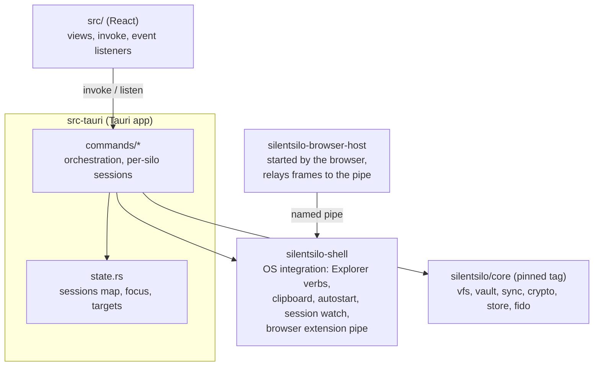
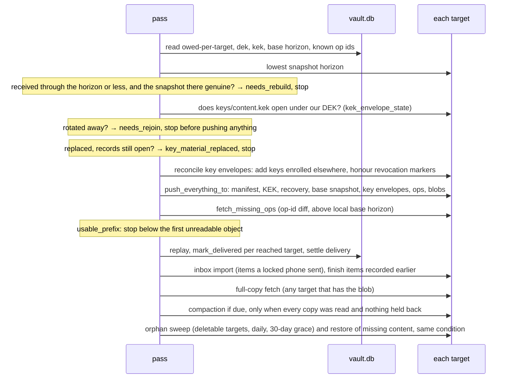
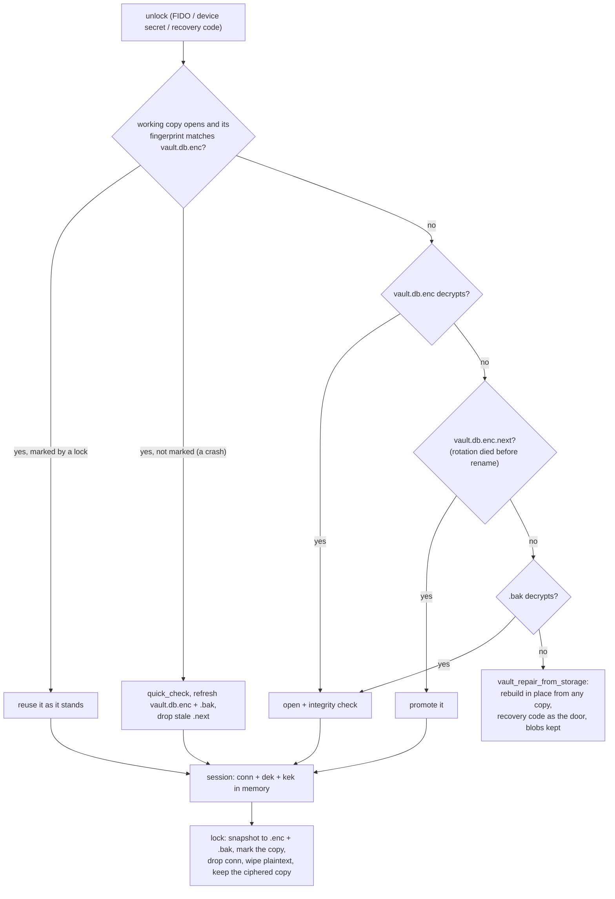
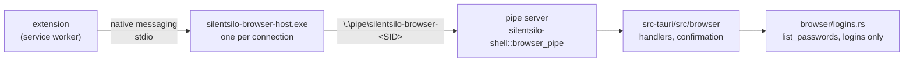

# Architecture map (desktop)

The working map of the desktop application: how a silo is opened, held and
closed, and the order a sync pass runs in. Written for whoever changes this
code next, human or tool.

Everything below the application lives in
[silentsilo/core](https://github.com/silentsilo/core): the key hierarchy, the
persisted formats, the operation log, compaction, the blob lifecycle and the
recovery matrix. Read that map first when a change touches sync, the vault,
crypto, the oplog or blobs. This repository pins a core tag in
`Cargo.toml`, and moving that pin is the moment the two are tested together.

The other documents each own one slice: [STORAGE.md](STORAGE.md) speaks to
users, [ORGANISATIONS.md](ORGANISATIONS.md) is IT procedure. This page owns
the application's moving parts.

**Keep it true.** A change that alters anything described here updates this
page in the same commit. A stale map is worse than none: it answers with
confidence and it answers wrong.

## Shape

```mermaid
flowchart TD
    subgraph app["src-tauri (Tauri app)"]
        CMD["commands/*<br/>orchestration, per-silo sessions"]
        STATE["state.rs<br/>sessions map, focus, targets"]
    end
    SHELL["silentsilo-shell<br/>OS integration: Explorer verbs,<br/>clipboard, autostart, session watch,<br/>browser extension pipe"]
    HOST["silentsilo-browser-host<br/>started by the browser,<br/>relays frames to the pipe"]
    FE["src/ (React)<br/>views, invoke, event listeners"]
    CORE["silentsilo/core (pinned tag)<br/>vfs, vault, sync, crypto, store, fido"]

    FE -->|"invoke / listen"| CMD
    CMD --> STATE
    CMD --> SHELL
    CMD --> CORE
    HOST -->|"named pipe"| SHELL
```

The application is the only layer that knows there is a window. It owns the
flows (unlock, enrol, join, rotate, recover, import, export), the per-silo
session map and the event names the frontend listens to. `silentsilo-shell`
is the only crate here that talks to the operating system, and it is the one
a port to another desktop platform rewrites.

The 119 commands are the whole contract with the frontend, along with their
parameter names, their event names and payload shapes, and the error strings
`src/lib/errors.ts` matches on. None of those may change without changing
the frontend in the same commit.

**No command runs on the main thread.** Tauri puts a plain
`#[tauri::command] fn` on the thread that owns the window and pumps its
messages, so anything that command waits for is a window that stops
redrawing and stops taking clicks. Every command here is either an `async
fn` or carries `#[tauri::command(async)]`, which is why commands that borrow
`State<'_, AppState>` all return `Result`. The waits are not hypothetical:
the sessions mutex is held across a replay, the keyring and DPAPI are a
round trip per stored target, and the clipboard is taken by sleeping between
retries. The handful with no bound at all (`app_bootstrap` enumerating
authenticators, `full_copy_status` walking the blob directory, `sync_status`
and `backup_targets_list` polled while a pass holds the lock,
`copy_secret_to_clipboard`) go further and run their body through
`run_blocking`, so they occupy a pool thread rather than one of the async
runtime's workers, which is where the sync pass's network work lives.

## Sync pass anatomy

The pass is core's `silentsilo_app::run_sync_pass`; this app calls it from
`commands/sync.rs::run_sync_pass` with `DesktopHost`, which sends its events
to the window as `sync-report`, `sync-progress` and `vault-changed`, logs its
warnings and reads the stored copies. The desktop had its own copy of the
pass until 1.2; the two drifted, and only core's was under the fleet and
lifecycle tests. `AppState` holds core's state and derefs to it, so a pass
and a command lock the same sessions and the same `sync_in_flight`. The
steps, in this exact order, each placed for a reason:

```mermaid
sequenceDiagram
    participant P as pass
    participant DB as vault.db
    participant T as each target
    P->>DB: read owed-per-target, dek, kek, base horizon, known op ids
    P->>T: lowest snapshot horizon
    Note over P: received through the horizon or less, and the snapshot there genuine? → needs_rebuild, stop
    P->>T: does keys/content.kek open under our DEK? (kek_envelope_state)
    Note over P: rotated away? → needs_rejoin, stop before pushing anything
    Note over P: replaced, records still open? → key_material_replaced, stop
    P->>T: reconcile key envelopes: add keys enrolled elsewhere, honour revocation markers
    P->>T: push_everything_to: manifest, KEK, recovery, base snapshot, key envelopes, ops, blobs
    P->>T: fetch_missing_ops (op-id diff, above local base horizon)
    Note over P: usable_prefix: stop below the first unreadable object
    P->>DB: replay, mark_delivered per reached target, settle delivery
    P->>T: inbox import (items a locked phone sent), finish items recorded earlier
    P->>T: full-copy fetch (any target that has the blob)
    P->>T: compaction if due, only when every copy was read and nothing held back
    P->>T: orphan sweep (deletable targets, daily, 30-day grace) and restore of missing content, same condition
```

- **Push before pull**: a record that exists only locally has no other
  copy anywhere; it goes out before anything else can go wrong.
- **Fetch diffs op ids against the listing**, never a Lamport watermark: a
  device that was offline pushes records below everyone's high-water mark,
  and a watermark skips them forever (then compaction deletes them from the
  bucket, which is how a file vanishes silently). The local base horizon is
  the one lower bound that stays: records at or below it are covered by the
  base snapshot and must never be re-applied.
- **Unreadable objects hold back, not wedge**: replay stops below the first
  unreadable Lamport value, because applying past a hole turns the missing
  record's dependents into `Obsolete`, which is permanent. The rest of the
  silo keeps syncing; the objects are reported and retried. A record that
  opens but sits under another record's name is a copy storage made, and is
  skipped.
- **Compaction and the sweep need the whole picture**: both act on what
  this device believes is referenced, so a pass with a record held back, an
  unreadable object, or a copy it could not read runs neither. The same
  complete passes record `received_through`, the highest Lamport value
  storage listed, which is what the horizon check compares against: the
  highest local record counts this device's own writes and hid a device
  that wrote a lot offline.
- **A target that does not answer is not a target that is empty**: the
  horizon comes from the targets that answer, and one whose records stop
  below the highest horizon is left out as stale. When none answers, each
  is marked failed and backs off. A pass that errors, or stops before any target records an outcome
  (rebuild, rejoin, replaced key), holds that silo's background passes for
  `PULL_INTERVAL_SECS` even with changes waiting (`pass_due`); pressing
  Sync is not held.
- **The sweep waits 30 days and puts content back**: a candidate is deleted
  only when an earlier sweep saw it unreferenced and this device first saw
  that 30 days ago (`blob_gc_seen`). A device that has not synced can still
  move a file over content the others stopped referencing. The same listing
  uploads content a row here points at and the target lacks, from the cache
  or another copy (`silentsilo_sync::restore_missing_blobs`), counted in
  `blobs_restored`. Content no row references is never sent, so emptying the
  trash is not undone. The same daily sweep aborts unfinished S3 uploads
  older than 24 hours under `blobs/`, `snapshots/` and `inbox/`
  (`silentsilo_sync::abort_stale_uploads`); a failure there is a warning and
  the sweep carries on.
- **Ops before blobs on push, and on the same push**: a visible file whose
  content has not arrived self-corrects next pass; content with no record
  looks like an orphan and gets swept. Same reasoning gives the join order
  in `push_everything_to` (identity first, snapshot before log, content
  last).
- **Keys reconcile before the push**: a device learns keys other devices
  enrolled, and a revocation leaves a sealed marker the others honour.
  Publishing first would put back a key another device just revoked. A
  tombstone is dropped only once its marker is in storage. The step is
  core's `silentsilo_sync::reconcile_key_envelopes`, run the same way as in
  `silentsilo-app`.
- **A content key that will not open is two different things**, and
  `kek_envelope_state` reads the records beside it to tell them apart. If
  they do not open either, the silo's key was rotated and this device was
  not kept: `needs_rejoin`, and the screen says to rejoin. If they still
  open, no rotation produced that state, because a rotation re-seals the
  records first and writes this object last. The object was replaced or put
  back from an older copy, so the pass reports `key_material_replaced` and
  the screen says the storage is what has to be fixed. Rejoining fetches the
  same object and fails on it, which is why the two must never share a
  message. Every target that answers is asked, and the gravest answer wins
  (`gravest_kek_state`: rotated, then replaced, then current): a copy that
  missed a rotation still says current, and letting the first answer decide
  pushed its stale envelope over the rotated one. Never-delete copies vote
  only on a silo with no working copy: a rotation does not touch them, so to
  a device on the new key they always look rotated, and counting them sent
  it to rejoin in a loop, or whenever the working copy was unplugged. One
  that reads as rotated beside working copies is retired: left out of the
  pass with `RETIRED_COPY` as its status and not counted as a copy to reach,
  since waiting on it held the inbox, the sweep and compaction for good.
- **The inbox imports after the push and pull**: an item recorded in one
  pass leaves the inbox only in a later pass that reached every target, so
  it is never gone from storage while its record exists on this machine
  alone. With more than one target the content is fetched down for the next
  push to spread. Core's `silentsilo_app::inbox_import`, fed this app's
  session map without touching idle timers.
- **Delivery accounting is per target** (`op_delivery`, `blob_delivery`):
  `pushed`/`synced` mean "every configured target has it", which is the only
  meaning that makes local pruning and eviction safe. Removing a target
  drops its rows; a target added later is owed everything, including
  history. Core's `mark_delivered` writes the whole list under a savepoint,
  which nests inside the transaction this pass wraps the per-target loop in,
  so one commit covers every target: a target owed a long history used to pay
  for a commit per record with the sessions mutex held. A delivery that does
  not commit leaves the records owed, which the next pass settles by finding
  them already in storage. Delivery follows the push alone: a target whose
  push went through and whose fetch failed has its records marked, and the
  fetch failure is still its reported failure.
- **A pass reports bytes as well as items**: `sync-progress` carries
  `bytes_done` and `bytes_total`, non-zero only while one blob is uploading,
  because the blob count stands still for the whole of a large file. The file
  a blob belongs to is looked up once per blob and reused across that blob's
  reports: the lookup takes the sessions mutex, and four a second for a
  gigabyte would put progress reporting in front of everything else. Filling
  one copy from another (`backup_target_seed`) reports the same way on
  `seed-progress`, and its Stop now lands inside an object rather than after
  it.

## Session and lock lifecycle

```mermaid
flowchart TD
    U["unlock (FIDO / device secret / recovery code)"] --> WC{"working copy opens and its<br/>fingerprint matches vault.db.enc?"}
    WC -->|"yes, marked by a lock"| REUSE["reuse it as it stands"]
    WC -->|"yes, not marked (a crash)"| ADOPT["quick_check, refresh vault.db.enc + .bak,<br/>drop stale .next"]
    WC -->|no| DEC{"vault.db.enc decrypts?"}
    DEC -->|yes| OPEN[open + integrity check]
    DEC -->|no| NEXT{"vault.db.enc.next?<br/>(rotation died before rename)"}
    NEXT -->|yes| PROMOTE[promote it]
    NEXT -->|no| BAK{".bak decrypts?"}
    BAK -->|yes| OPEN
    BAK -->|no| REPAIR["vault_repair_from_storage:<br/>rebuild in place from any copy,<br/>recovery code as the door, blobs kept"]
    OPEN --> SESSION["session: conn + dek + kek in memory"]
    ADOPT --> SESSION
    REUSE --> SESSION
    PROMOTE --> SESSION
    SESSION --> LOCK["lock: snapshot to .enc + .bak, mark the copy,<br/>drop conn, wipe plaintext, keep the ciphered copy"]
```

The working copy wins over the snapshot while its fingerprint matches: it
holds the snapshot or more, everything since the last lock after a crash.
Anything else that wrote `vault.db.enc` gets a fresh export (core's
ARCHITECTURE.md, "The working copy outlives the lock"). Up to three
silos stay open (`MAX_OPEN_SILOS`), least-recently-used evicted; every way
in funnels through `open_focused_session`, which refuses a session that is
not the focused silo's (the focus moved while it was opening). Long
operations snapshot the session's cheap parts (`SessionSnapshot`) and take
the sessions mutex only per row, never across encryption or network work;
they pin the silo id they started on rather than re-reading focus. A decrypt
that finishes after its silo locked deletes what it wrote
(`state::discard_if_locked`) instead of opening it.

The silo evicted to make room is taken out of the map under the mutexes and
snapshotted after they are released, and its eviction does what a lock
does: its copied password is taken back and `scratch-still-open` is sent
when a file stays held. Every way in registers the silo root in
`AppState::opening` (`state::opening`) before building a session, until it
is in the map or abandoned, and the scratch sweep that follows any lock
keeps those roots as if open: the sweep runs from other threads and would
otherwise delete a working copy being opened. A silo that is not open gets
no idle timer (`touch_if_open`, and `idle_seconds` lists open silos only),
and a lock takes back the clipboard only when the secret on it came from a
silo being closed. Close and lock carry on through a mutex a panic
poisoned, rather than reporting a lock that closed nothing. On exit each
open silo is closed once, and closing writes its snapshot; nothing flushes
before it.

Auto-lock is decided twice. The window's sweep asks `silo_idle_status`
every 15 seconds and locks a silo past its own timeout, or the app-wide one
set under General. A Rust task does the same every 30 seconds with two
minutes' margin (`spawn_idle_backstop`), for a window that crashed or hung,
which used to leave the silo open until the app quit. The app-wide default
lives in the window's settings; the window tells Rust at start and on every
change (`app_set_auto_lock_default`), and no silo opens before it has. A
silo the backstop locks is announced as `silo-idle-locked`.

Removing a silo from the list keeps its ciphered working copy unless the
files go too: while the folder stays, that copy can hold the only record of
changes since the last snapshot.

Key operations (enrol, add, remove, rotate, resume), the snapshot rebuild and
a seed take the sync flag for as long as they run (`sync::hold_sync`), after
waiting up to 90 seconds for a running pass. A pass that loaded `fido.json`
before a key change and saved it after would put the old envelopes back.

A key change (rotate or resume) opens every target before the first touch
and stops if one will not open: skipped, it would keep the old key readable
there. The re-wrapped keys and the new recovery envelope commit with the key
in core (`rotation::commit_rotation_with`); past that commit an error locks
the silo. A seed runs with the silo's key (`seed_target_checked`), so a copy
that missed a rotation cannot put the old key back on another.

## Security key PIN

On Linux and macOS the app talks to a removable key itself (core's
`ctap2`), so a key's PIN is asked in the window: `pin::install` gives core a
prompt that emits `fido-pin-request` from the ceremony's blocking thread and
waits up to two minutes for `fido_pin_answer`; `SecurityKeyPinDialog` sits
beside the toasts, so it shows on every screen, unlock and enrolment
included. A key with a PIN is always asked for it, as Windows asks in its
own dialog: `hmac-secret` gives another secret without it, and a key asked
differently on two platforms would open neither's silo on the other.

## Activity log

Core owns the format, the queue on this computer and its delivery (core's
ARCHITECTURE.md and `FORMATS.md`). This app decides what is an event and
when it is written (`src-tauri/src/audit.rs`). Nothing is written until a
log is turned on for the silo; until then every call returns at once. The
switch (`audit_set_enabled`, `AuditLogPanel`) acts on this computer at once
and asks for a sync, which carries the policy to the copies; core's pass
does that part. Reading (`audit_read`) and export (`audit_export`, CSV with
formula-like cells kept as text, or JSON lines) go through core's
`read_audit_log` with the silo's content key; where the silo keeps no log,
the page shows the oplog's list of changes instead. A silo that keeps a log
says so in the sidebar for as long as it is open (`AppShell`'s
`activityLog`, read from `audit_status` when a silo opens and whenever the
switch moves): whoever uses the silo is told, which an organisation's log
in particular owes the people it records.

An organisation's log asks for an organisation key at every step
(`fido::touch_organisation_key`, which is `prove_organisation_key` keeping
the wrap key): starting it (`audit_org_start`, or by itself at the first
enrolment of an organisation key), reading and exporting it, changing the
retention and removing old segments. Adding an organisation key wraps the
log's key for it with the touch that authorised the addition; a silo whose
log was never started starts it there.

- What leaves the silo is recorded before it happens: a secret shown or
  copied, a file or attachment opened or saved outside, a login filled in the
  browser, passwords exported. A change inside the silo is recorded before
  it is stored too, so nothing happens unrecorded; one that then fails
  leaves an event for something attempted. Imports are the exception: one
  event with the count, after the fact, never refused.
- An organisation's silo whose event cannot be written is locked
  (`audit::record_in`) and the action refused; the window hears
  `silo-audit-locked`. A personal one logs a diagnostic and goes on.
- The window holds the entries, so showing one is something only it sees.
  `audit_note` takes exactly two notes from it, `entry_revealed` and
  `passwords_imported`; everything else is recorded in the command that does
  it. A copy carries what it was (`CopiedSecret`) and is recorded inside
  `copy_secret_to_clipboard`, before the clipboard holds it. A save says what
  it was (`EntryChange`), which only the window knows: new or edited, a
  restore, cleared history, one of an import.
- The lock is the session's last event (`silentsilo_app::record_lock`, from
  `close_one`), which also closes the batch into a segment for the next
  pass.
- Recording takes the sessions mutex and the queue's file lock, so it is
  never called with the sessions mutex held.

## Cloud sign-in

OneDrive, Dropbox and Google Drive copies are reached by signing in, not
with keys the user pastes. `cloud_sign_in` hands core's
`silentsilo_vault::cloud_sign_in` an opener for the system browser; core
binds the loopback listener, runs PKCE and the code exchange, asks the
provider which account it reached and keeps the tokens in the process as a
pending sign-in. The command returns the account to show and an id, nothing
else: no code or token ever reaches the frontend.

The form then saves the copy with `{kind, signIn, folder}`. Core builds the
target from the pending sign-in's account, never from anything the UI sent,
and `storage::describe` opens it with the pending tokens for the usual
checks (foreign vault, test write). Only after the list is saved does
`Described::adopt` store the refresh token under the target id, so a check
that fails leaves no token behind. Joining from backup storage does the
same after `save_s3_config`, inside the join's cleanup.

`backup_target_reconnect` gives a copy a new sign-in when the old one stops
working, and refuses another account: the copy would point at an empty
folder. Removing a copy, or disconnecting, ends Dropbox sign-ins at Dropbox
(`end_cloud_sign_in`); Google's revocation would end every computer's
sign-in to that account, and Microsoft has none for personal accounts, so
those are only forgotten here. Saving a shorter list forgets the dropped
targets' tokens in core either way.

A finished sign-in nothing saves is let go: the form's Cancel or Back, and
signing in again in the same form, call `cloud_discard_sign_in` for the ones
it held (`discardSignIns` in `StoreConfigForm`), and when the last silo
locks every unsaved one goes (`forget_sign_ins_when_all_locked`). Not when
the form unmounts: a parent may swap it for a progress screen while the save
it started is still adopting the sign-in. A discard after a save is harmless,
since adoption already took the sign-in out of the list.

One sign-in runs at a time (`SignInSlot`). Cancel, or starting another,
drops the waiting future, which closes the listener and frees its port. The
error for that says "stopped", not "cancelled": `errors.ts` reads the
second word as a security key prompt. `cloud_providers` lists what this
build can sign in to; a build without Google's client secret leaves Google
Drive out.

## Browser extension

The extension (silentsilo/browser) fills a username and a password into a
page, and offers one typed on a page for saving here, and nothing else. Its contract with this app is `docs/PROTOCOL.md` in
that repository; message shapes change there first. The path:

```mermaid
flowchart LR
    EXT["extension<br/>(service worker)"] -->|"native messaging<br/>stdio"| HOST["silentsilo-browser-host.exe<br/>one per connection"]
    HOST -->|"\.\pipe\silentsilo-browser-&lt;SID&gt;"| PIPE["pipe server<br/>silentsilo-shell::browser_pipe"]
    PIPE --> H["src-tauri/src/browser<br/>handlers, confirmation"]
    H --> L["browser/logins.rs<br/>list_passwords, logins only"]
```

- **The host** (`crates/silentsilo-browser-host`) is a separate small binary
  so the browser never starts the app, with its webview, to relay a message.
  The browser names the calling extension in the arguments, in one of two
  forms. Chrome, Edge and Brave pass its origin first
  (`chrome-extension://<id>/`, then `--parent-window=<n>`); Firefox passes
  the path of the manifest it read, then the add-on id. The host takes a
  `chrome-extension://` first argument as the Chromium form and checks it
  against the Chromium list only; anything else must be a `.json` path
  followed by an id on the Firefox list (`allowed_caller`). It refuses a
  caller on neither before it opens the pipe. The lists are compiled in.
  `allowed-origins.json` holds the store ids: `chrome_web_store` holds the
  Chrome Web Store id, `firefox_add_ons` holds `browser@silentsilo.com`,
  and `edge_add_ons` holds the Edge Add-ons id (Brave installs from the
  Chrome Web Store and has no list).
  `allowed-origins.dev.json` holds the development Chromium id, let in only
  by debug builds and builds with the `dev-extension` feature. It is pinned
  by a developer's own key, which no repository holds. A Firefox id is
  chosen by its author and becomes unique only when someone first submits
  it to addons.mozilla.org; our submission of 20 September 2026 claimed
  `browser@silentsilo.com`, the id fixed in the extension's
  `browser_specific_settings`, so it moved from the dev list to the release
  list, and the dev list has no Firefox id now. `--check-release` fails a
  host that lets a dev id in or names no store id.
  `build-release-local.ps1` checks the JSON before it starts
  (`browser-host-release.ps1`, the same rule as `release_verdict`): all
  three lists empty means the release ships without the host, so a desktop
  release never waits for a store listing, and any one of them, the Firefox
  list included, ships it. A dev id of either kind in a release list,
  anything but a plain extension origin in a Chromium list, or anything but
  an add-on id as MDN defines it (`name@domain` of at most 80 characters, or
  a GUID in braces) in the Firefox list stops the build. When the host
  ships, the script runs `--check-release` on the built binary. Unit tests
  keep the dev ids out of the release file. `--write-manifest` writes both manifests
  the browsers read: `silentsilo-browser-host.json` with `allowed_origins`
  for Chromium, `silentsilo-browser-host.firefox.json` with
  `allowed_extensions` for Firefox. A Firefox temporary add-on can claim any
  id, as an unpacked Chromium extension can claim a store id through its
  key, so an id on the list says which extension it claims to be, not which
  one it is.
- **No host, no pipe.** When `silentsilo-browser-host.exe` is not beside the
  app, Settings shows "The browser extension is not part of this build."
  instead of the toggle, and the pipe is never opened, whatever the saved
  setting says. In development, `cargo build -p silentsilo-browser-host`
  puts it beside the debug app.
- **Store links.** Under the toggle, "Get it for Chrome", "Edge", "Brave"
  and "Firefox" open the extension's listing in the default browser through
  the opener plugin. The URLs are in `src/lib/extensionStores.ts`, empty
  until each listing exists; an empty one shows no link, and one that is
  not https on the store's own host is never shown. Brave uses the Chrome
  Web Store link. The installer never installs the extension. The setting
  stays off by default, as Bitwarden's and KeePassXC's browser integration
  do: while it is on, any program of this user can reach the channel. A
  click on a store link turns it on, since getting the extension says the
  person wants it to reach the app.
- **The host checks who started it** (release builds only; tests start it
  from cargo). Its parent must be one of these, under `<Program Files,
  Program Files (x86) or %LOCALAPPDATA%>`, running as this user, with a
  valid Authenticode signature from the publisher named:
  `Google\Chrome*\Application\chrome.exe` (Google LLC),
  `Microsoft\Edge*\Application\msedge.exe` (Microsoft Corporation),
  `BraveSoftware\Brave-Browser[-Beta|-Dev|-Nightly]\Application\brave.exe`
  (Brave Software, Inc.), or `<Mozilla Firefox | Firefox Developer Edition |
  Firefox Nightly>\firefox.exe` (Mozilla Corporation). The browser must
  match the argument form: a Chromium origin from Chrome, Edge or Brave, a
  Firefox id from Firefox. Chromium browsers start a host through
  `cmd.exe` unless a policy says otherwise, so a `cmd.exe` in a system
  directory between the two is stepped over. Firefox starts an `.exe` host
  directly from its main process (`NativeMessaging.sys.mjs` through
  `Subprocess`, which goes through `cmd.exe` only for `.bat` and `.cmd`), so
  a Firefox behind `cmd.exe` fails. Firefox from the Microsoft Store (MSIX,
  under `WindowsApps`) is not on the list. A parent whose id was reused
  (started after the host) fails. Anything else exits with code 3, before
  the pipe is opened.
- **The host checks the pipe is the app's** before writing to it. The pipe's
  owner SID (`GetSecurityInfo`) and the server process's token user
  (`GetNamedPipeServerProcessId`) must be this user, and the server's image
  must be `SilentSilo.exe` in the host's own directory (debug builds may name
  another through `SILENTSILO_BROWSER_HOST_TEST_SERVER`, for the tests).
  The client opens with `SECURITY_IDENTIFICATION`, so a server can never
  act as it. On any mismatch the host answers `app-not-running` to each
  request with a message of its own, writes nothing to the pipe and never
  relays. When nothing listens it answers `app-not-running` itself and
  exits when stdin closes. It never starts the app. The extension closes
  the port after that answer, so its next request starts a new host, which
  finds the app once it runs with the setting on. It copies frames without
  parsing them beyond the 64 KiB limit, and wipes each one after passing it
  on.
- **The pipe** is `\.\pipe\silentsilo-browser-<user SID>`, created with a
  protected DACL granting the current user alone (`O:<SID>D:P(A;;GA;;;<SID>)`),
  remote clients rejected, and the first instance created with
  `FILE_FLAG_FIRST_PIPE_INSTANCE`, so a program that took the name first
  makes the toggle fail rather than receive the extension's requests. It
  exists only while Settings > Browser extension is on
  (`%LOCALAPPDATA%\SilentSilo\browser-extension.json`, off by default). The
  server runs on the async runtime, one task per connection and one per
  request, so a fill waiting for the user does not hold up a `status` on the
  same connection; at most four requests per connection are in progress,
  and the next frame is read only when one ends. When it cannot create the
  next instance (all 16 taken) it retries with backoff up to 5 seconds
  instead of stopping, since a stopped server would free the name. Each new
  instance must be owned by this user, or the server stops. It stops on exit
  and when the toggle goes off; a fill still waiting then ends with its
  connection.
- **The app checks who connected** (`ClientCheck`, before reading a byte).
  `GetNamedPipeClientProcessId` gives the client; it must run as this user,
  from `silentsilo-browser-host.exe` beside the app's own executable, and in
  release builds carry an Authenticode signature whose signing certificate
  is the app's own. Any other client is disconnected unread and the refusal
  goes to the diagnostics log. A release built without signing therefore
  admits no host.
- **What a client may ask is rationed** (`browser/limits.rs`). `logins`,
  `search` and `show` share a bucket of 20 per connection, one more per
  second, and one of 60 across all connections, one more per half second.
  `search` also has its own of 15 across all connections, one more per 4
  seconds: a search names logins saved for other sites, with usernames, so
  a sweep of two-letter queries would list the silo, and now takes most of
  an hour. A `search` under two characters finds nothing. `fill` has 3 per connection,
  one more per 20 seconds, and 4 across all connections, one more per 30
  seconds. After a fill ends without a confirmation (declined, timed out, or
  its connection gone), no fill dialog opens for 10 seconds, whoever asks.
  A fill refused for that pause, or because another fill is waiting, spends
  neither `fill` ration (`limits::admit_fill`), so clicks during a
  confirmation do not use up the fills after it.
  The Fill button stays inert for 700 ms after a question appears, and the
  key prompt names the login and the site.
- **Fills are listed** under Settings > Browser extension: site, login and
  time of each fill that sent a password since the app started, the last
  20, in memory only. A program running as this user can click Fill itself,
  and Windows Hello face recognition can pass with nobody doing anything;
  the list is where such a fill shows up. A security key, or a Hello PIN or
  fingerprint, needs a person. A `show` within 3 seconds of the
  last one acted on, from any connection, is refused. Past any of these the
  answer is `busy`.
- **`show` brings the window forward** and does nothing else. The popup's
  "Open SilentSilo" button sends it when the silo is locked or there is no
  silo. The handler runs `commands::shell::show_main_window` (show,
  unminimise, focus) through `run_on_main_thread`, the same call the
  single-instance handler makes, and never sets always-on-top. No frontend
  code is involved: a locked silo already renders `UnlockView`, and the
  unlock is the usual one. The answer is `{ id, type }` and nothing about the
  app's state; nothing waits for the unlock, and no fill follows it.
- **The extension sees logins and nothing else.** `browser/logins.rs` is
  the only module in `browser/` that reaches the vault, and its one call is
  `list_passwords`. It keeps label, username and saved address of entries
  whose type is `login` and which have a password; files, folders, notes,
  one-time codes, attachments, cards and protected folders are never read,
  so no answer can name them. A test there holds the rest of `browser/` to
  that (it fails if `mod.rs` or `protocol.rs` mention the file API), and
  another puts a file in a silo and checks that searching for its exact name
  finds nothing and that no answer contains it.
- **Passwords stay out of listings, mostly.** `list_passwords` decrypts
  every entry, secrets included, on every `logins`, `search` and `fill`.
  The listing keeps the metadata and wipes the parsed rows and the JSON at
  once; the one password a fill sends is read again, by entry id, only after
  the confirmation and the key check passed. A listing that never decrypts
  the secrets needs a metadata-only query in core; that is a follow-up, not
  something desktop can do alone.
- **Matching** (`browser/protocol.rs`): only `https:` tabs, plus `http:` on
  `localhost` and loopback addresses; any other scheme gets an empty list.
  A login matches when the host of its saved address equals the tab's host,
  or one is `www.` plus the other. No parent domains, no look-alikes, no
  guessing from the label. Ports must be equal: an address without one means
  its scheme's default (443, or 80 for `http://`), never any port, and an
  `http://` address also matches the same host over https on 443. On
  loopback, where each port is another program, the ports must be written
  the same (`localhost` matches only a tab without a port). The saved
  address is free text, so one without a scheme is read as `https://`, and
  an `android://` identity names no site. A `search` result carries `site`,
  where its login was saved for, so the popup can say so before a fill.
- **Refs** are random tokens mapped to entry ids, scoped to the focused silo
  and to `AppState::session_epoch`, which moves on every unlock, lock and
  focus change. A ref from before any of those is `unknown-ref`.
- **A fill is confirmed here, every time.** A silo with no security key and
  no Windows Hello enrolled is answered `no-authenticator` at once, since
  the check below could never pass; Settings says so beside the toggle. The
  request brings the window to the front, above other windows while it
  waits, and shows `BrowserFillDialog`: a fill request from the browser for
  the site, the login, and in words when the login was saved for another
  site (it came from `search`). It does not claim the extension sent it: the
  app cannot know that (below). Fill runs `commands::vault::verify_presence`,
  the same Windows Hello or security key check `fido_reverify` uses for a
  protected entry, whatever that entry's own setting; no grace period. Only
  once it passes is the password read and written to the pipe, in a buffer
  sized up front and wiped after the write. One fill waits at a time
  (`busy`), for 90 seconds (`cancelled`); a lock or focus change while it
  waits ends it. After a confirmed fill the window goes back to hidden or
  minimised when that is how the request found it, and on Windows the window
  that was in front when the request came in gets the focus back
  (`silentsilo_shell::foreground_window`, taken by its root owner so the
  popup, which closes when the app comes up, resolves to its browser
  window). A window that was on screen stays open behind the browser.
  The app drops always-on-top itself, synchronously, first: Tauri's call
  lands later, and a browser brought forward under a window still on top
  stays hidden (a maximised SilentSilo covered it entirely). Windows grants
  the foreground only while the app holds it, which it gets back a moment
  after the Windows Hello prompt closes, so the handover is retried for up
  to 1.5 s; if it never takes, the app's window goes to the bottom instead.
  On macOS nothing is remembered yet. A silo that is unlocked but whose logins cannot
  be read is answered `read-failed`, never `locked`: an extension that
  predates the code shows its generic line for it.
- **A save is decided here too** (since 1.4.0). `save` carries the origin,
  the username and the password the extension read from the page on the
  person's click; the parser refuses an empty password and either value
  over 1024 characters. It spends the `logins` rations, not the fill ones,
  and is refused like a fill during the 10 second pause and while a fill or
  another save waits: one question at a time. `protocol::same_login` finds
  the login saved for this site with the same username (ignoring case and
  spaces), and `BrowserSaveDialog` offers to update it or to save a new one,
  named after the site; the person can change the name and the username.
  No key check: saving reveals nothing, and the dialog is the confirmation.
  The prompt carries the password to the window, because the window writes
  the entry through `savePasswordEntry`, the same path as an edit: an update
  keeps the old password in the history, and the activity log records the
  change. When the login is already there with this password, the dialog
  says so and offers only Close. The window then calls `browser_save_done`,
  and the extension hears `saved` or `updated`; Cancel, 120 seconds, or a
  lock or focus change is `cancelled`. The window goes back and the browser
  gets the focus as after a fill.
- **Installed as an externalBin**, merged in by `build-release-local.ps1`
  through `src-tauri/tauri.browser-host.json` rather than kept in
  `tauri.conf.json`: tauri-build requires an externalBin to exist on every
  compile of the app, CI's included. Tauri signs it with `signCommand` like
  the app, which is what the app's signer check compares. The NSIS hooks run
  `--write-manifest`, then `--registers chrome|edge|firefox` for each key:
  `HKCU\Software\Google\Chrome\NativeMessagingHosts\com.silentsilo.desktop`
  and `HKCU\Software\Microsoft\Edge\NativeMessagingHosts\...` point at the
  Chromium manifest, `HKCU\Software\Mozilla\NativeMessagingHosts\...` at the
  Firefox one. A key is written only when its browser's list has an id, and
  removed otherwise. Brave has no key of its own: on Windows it reads
  `SOFTWARE\Chromium\NativeMessagingHosts`, then Chrome's, HKCU before HKLM
  (upstream `launch_context_win.cc`, which brave-core does not override;
  both strings are in Brave's `chrome.dll`), so Chrome's key serves it.
  The uninstaller removes the three keys and both manifests. The installer
  never installs an extension. A plain `npm run tauri:build`, or a release
  made while the store lists are empty, has no host, and the hooks skip
  it.

### On Linux

The same host and the same frames over a Unix socket instead of a named
pipe (`browser_pipe`, `#[cfg(unix)]`). What changes, and why it holds:

- **The socket** is `$XDG_RUNTIME_DIR/silentsilo/browser.sock`, in a
  directory made `0700` and with the socket itself `0600`. The runtime
  directory is the user's own, on tmpfs, and no other user can enter it.
  Without `XDG_RUNTIME_DIR` there is no socket and Settings says so; there
  is no fallback to `/tmp`, which every user shares. A socket file already
  there is tried first: one that answers belongs to another running app,
  and the toggle fails rather than take it over; one that does not is left
  from a crash and is removed.
- **The app checks who connected** before reading a byte: `SO_PEERCRED`
  gives the peer's user and process. It must run as this user, and
  `/proc/<pid>/exe` must be the host the manifests name (same device and
  inode). There is no signature to read on Linux: what stands in for it is
  where the host lives. Installed from the `.deb`, it is
  `/usr/bin/silentsilo-browser-host`, beside the app and owned by root
  (Tauri installs an `externalBin` there; the release job builds it and runs
  `--check-release` first). From the AppImage, whose files exist only while
  it runs, the app copies its host to
  `~/.local/share/SilentSilo/browser-host/` when the toggle goes on, and
  checks against that copy (`install_host_copy`, `installed_host_path`).
- **The host checks the socket is the app's**: `SO_PEERCRED` on the server
  must be this user, and the socket is in this user's runtime directory,
  which nothing else can write. It does not check who started it: on Linux a
  browser may start it through a portal (Firefox as a snap) or a sandbox
  helper, so the parent proves nothing.
- **The manifests** are written per user when the toggle goes on and
  removed when it goes off, by the host itself (`--install-manifests`,
  `--remove-manifests`), so the lists of ids stay compiled in one place,
  for each browser whose configuration directory exists: `~/.config/google-chrome/NativeMessagingHosts`,
  `~/.config/chromium/NativeMessagingHosts`,
  `~/.config/microsoft-edge/NativeMessagingHosts`,
  `~/.config/BraveSoftware/Brave-Browser/NativeMessagingHosts` (all as
  `com.silentsilo.desktop.json`, with `allowed_origins`) and
  `~/.mozilla/native-messaging-hosts` (with `allowed_extensions`), for any
  sign of Firefox: Firefox reads that place as a snap or a flatpak, through
  the WebExtensions portal, and from 147 on even with its profiles in
  `~/.config/mozilla` (reading the XDG place too is Mozilla bug 2005167),
  where a copy goes as well. Nothing is written
  under `/etc`: the `.deb` and the AppImage behave the same, and turning the
  toggle off undoes everything it did. Chromium as a snap or a flatpak does
  not reach native hosts outside its sandbox and is not supported.

The checks are weaker than on Windows in one way: a program running as this
user can replace the AppImage's copy of the host, as it can replace the
AppImage itself. That is the same user the next section already rules out.

### What these checks do not stop

They make a forged request cost more than opening a pipe. They do not keep
out code already running as the same user, and nothing here should be read
as if they did.

- **Same-user code can still ask for fills.** It can start the signed host
  with a parent of its choosing (`PROC_THREAD_ATTRIBUTE_PARENT_PROCESS`),
  inject into the browser or into the host, or drive the host's stdin after
  starting it from a real browser. The app then sees a legitimate client.
  What stands between such a request and a password is the person: the
  dialog names the site and the login, says the request came from the
  browser rather than from the extension, and needs Windows Hello or the
  key. Someone who confirms a fill they did not start hands it over.
- **Labels and usernames can still be listed**, slowly. The rations bound
  how fast; they do not make the list secret from a process that runs as
  this user and waits.
- **The install is per-user.** The app, the host and the manifest live in a
  folder this user can write, so a same-user process can replace or patch
  them. The signer check refuses a host that is not signed like the app; it
  cannot help once the app itself was replaced.
- **The checks are made on files, by path.** Signatures are read from the
  file at the process's image path, not from memory; revocation is not
  checked online.
- **Another user on the same machine** cannot open the pipe (the DACL), and
  cannot stand in for it without the host noticing (owner, server user and
  server image). An administrator can do anything.

## SSH agent (designed for 1.4, not built yet)

The SSH keys kept in a silo sign for `ssh`, `git` and VS Code without the
private key leaving the app, as 1Password's and Bitwarden's agents do.
Researched on 6 October 2026 against 1Password's documentation, the source
of Bitwarden's agent (v2, its own protocol code over `ssh-key`), KeeAgent,
KeePassXC, RFC 9987 and OpenSSH's `PROTOCOL.agent`.

- **Off by default**, a toggle under Settings like the browser extension.
  Nothing listens until it is on.
- **Where it listens.** On Windows, `\.\pipe\openssh-ssh-agent`, the pipe
  Windows' own `ssh.exe` uses, created as the first instance with a DACL for
  this user's SID only (Bitwarden takes tokio's defaults). When Windows'
  OpenSSH Authentication Agent service holds the name, the pipe cannot be
  created: Settings says so and shows how to stop and disable the service,
  which needs an administrator; the app never does it itself. Git for
  Windows' bundled ssh does not use the pipe; Settings gives the
  `core.sshCommand` line that points Git at Windows' `ssh.exe`, as
  1Password does. On Linux, `$XDG_RUNTIME_DIR/silentsilo/ssh-agent.sock`
  in the 0700 directory the browser socket uses, and Settings shows the
  `SSH_AUTH_SOCK` export and the `IdentityAgent` line for `~/.ssh/config`.
  The app writes neither file. No Pageant and no Cygwin sockets: neither
  competitor serves them, and KeeAgent's own documentation says its Cygwin
  socket has no authentication.
- **Which keys.** Only SSH-key entries of the focused silo with "Use with
  the SSH agent" turned on, the same silo the window and the extension
  see. Offering every key runs into the server's `MaxAuthTries` after a few
  (1Password needs an `agent.toml` for this). The setting is a new optional
  field in the entry, `ssh_agent: true`; an older client keeps it when it
  saves the entry, as it keeps `fields` and `history` (FORMATS.md, with a
  test on 1.0.0's code).
- **Key types.** Ed25519, RSA with `rsa-sha2-256` and `rsa-sha2-512`
  (SHA-1 `ssh-rsa` signatures are refused), ECDSA P-256 and P-384. The key
  is read from the entry as OpenSSH, PKCS#8 or PKCS#1 PEM. A key with a
  passphrase is asked for it once, when the agent is turned on for that
  entry, and stored without it, the old version kept in the history: the
  silo is its protection, and the agent cannot ask for a passphrase in the
  middle of a connection.
- **Every signature is confirmed here**, in a dialog like the browser
  fill's: the key, the program that asked (its executable path and its
  parent, from `GetNamedPipeClientProcessId` or `SO_PEERCRED`; shown, never
  trusted), the server's host key fingerprint when the client bound the
  session, and "Sign a git commit" when the data is an SSHSIG for git. The
  dialog can allow that key for as long as the silo stays unlocked, as
  1Password does by default and Bitwarden's "remember until lock": for one
  server's host key, or for git signatures. A request whose client did not
  name the server is asked every time, since allowing it would let any
  program sign with that key for any server. A lock (the idle timeout
  included), a focus change or turning the agent off forgets every
  allowance. An entry with
  "Require a touch to reveal" also runs the Windows Hello or security key
  check, as a fill does.
- **Forwarding.** The agent verifies `session-bind@openssh.com` (the host
  key's signature over the session id) and refuses a request on a forwarded
  connection: a server you connected to could otherwise sign as you
  elsewhere. A client that does not bind the session is treated as local,
  and the dialog says the server is unknown.
- **Locked or no silo.** The agent lists nothing and signs nothing. A
  request while locked brings the window to its unlock screen and waits up
  to 60 seconds; after an unlock it answers, otherwise it answers with no
  keys. Nothing of a key stays in memory while the silo is locked: the key
  is read from the entry for each signature and wiped after it.
- **What it refuses.** Adding or removing keys, locking the agent,
  smartcard and PKCS#11 requests, constraints it does not know (RFC 9987
  says to refuse), and any other extension. A frame over 256 KB closes the
  connection. Requests are rationed per connection as the browser's are.
- **The activity log** records each signature: the key, the program and
  the host when known.
- **Built on** `ssh-key` (already in the tree, MIT/Apache-2.0) for keys and
  signatures, with the agent's few messages written here rather than
  through `ssh-agent-lib`, which pins another `ssh-key` major version.
  macOS follows with its release, on `SSH_AUTH_SOCK` like Linux.

## Looks wrong, is deliberate

Read this before "fixing" any of it. The gotchas that live in the domain
crates are in core's map.

- **The desktop app is free and stays that way; wording is accountability,
  never warranty.** Every copy change goes through that filter.
- **A KeePass import encrypts attachments before anyone has said yes.**
  `passwords_read_kdbx` (`commands/kdbx.rs`) reads the database and puts
  each attached file straight into the silo as a blob, so the bytes never
  cross to the window or touch the disk in clear. The entries then wait for
  the filing question like any import, and a cancel, an empty entry or a
  duplicate deletes the blobs it made (`PasswordsPanel`, `dropBlobs`). What
  an entry becomes is decided in `lib/kdbx.ts`, with the CSV importers'
  rules. The export decrypts each attachment through the scratch directory
  and removes it as soon as it is read. Bitwarden's ".zip (With
  Attachments)" goes the same way: `passwords_read_bitwarden_zip`
  (`commands/bitwarden_zip.rs`) hands over `data.json` as text and encrypts
  each file under `attachments/<item name>/` as it reads it, counting the
  bytes it unpacks rather than trusting the zip. The folder is the item's
  name with the characters Windows forbids replaced, and a second item of
  the same name gets `_1` in an order the JSON does not give, so
  `attachZipFiles` (`lib/bitwardenJson.ts`) puts a file on an item only when
  exactly one item could have made its folder. The rest go on one note,
  "Files from Bitwarden", named by folder, never onto a guess.
- **An entry's history is written in `savePasswordEntry`, not by the
  editor.** Every save from the window passes there, a star or a restore as
  much as an edit, and `withHistory` (`lib/entryHistory.ts`) decides from the
  stored version whether anything the entry says changed. It reads that
  version from a ref, because the state update in the same function has not
  run when the entry is sent. A version never holds attachments: core counts
  blobs only from the entry itself, so one referenced from history alone
  would be swept.
- **Every door into a silo provisions through core, not through this app.**
  The key join, the recovery-code join and `vault_repair_from_storage` all
  end in `commands::sync::provision_joined_silo`, a call to core's
  `flows::recovery_join_provision`. The app keeps its own part either side
  (the ceremony, the registry entry, the keyring, the progress events) and
  hands the rest over. The reason is the key envelopes in storage: nothing
  signs the `policy` one claims, so an `org` planted by anyone who can write
  to the bucket would refuse key rotation and a new recovery code on the
  joined device for good, asking each time for a ceremony with a key that
  does not exist. Core keeps that claim only on the key that proved itself
  in this join, clears it everywhere else, and drops revoked keys and any a
  sealed marker names. Three copies of that rule would be three things to
  get wrong; `join_tests` in `commands/sync.rs` plants an `org` envelope and
  holds both doors to it.
- **A failed join leaves nothing behind.** Once the folder is registered, a
  join that fails is undone (`silo::JoinCleanup`): the registry entry, the
  secrets it wrote, the machine-local state and the silo's own files go, so
  trying again is not refused over a half-made silo. Both joins refuse a
  folder that is not empty, as creating does, so the undo never meets a
  file it did not write. The repair refuses, before it deletes anything,
  when the local copy still opens with the key the code produced.
- **The protected folders list refuses while the silo is locked.** The list
  and its import ledger are sealed under the content KEK, so there is nothing
  to read without an open session: `protected_folders_list`,
  `protected_folders_remove` and the scan all take the KEK from the session
  map and say "Unlock the silo first." otherwise. An empty list would tell
  someone they protect nothing, and a ledger that reads as empty imports every
  protected file a second time.
- **`additionalBrowserArgs` repeats flags nobody wrote here.** Setting it
  replaces wry's own default (`--disable-features=msWebOOUI,msPdfOOUI,
  msSmartScreenProtection`) rather than adding to it, so those three are
  copied in alongside `--disable-crash-reporter` and `--disable-breakpad`.
  Drop them and WebView2 gets back its out-of-process UI and SmartScreen.
  The crash flags are there because the whole decrypted password store is in
  the renderer while a silo is open, and a WebView2 crash dump is that
  memory on disk, then on its way to Microsoft. Edge's autofill and password
  autosave are turned off next to them, in `lib.rs`, over
  `ICoreWebView2Settings4`.

## Changing things

The checklist, in order:

1. **Does it touch anything in core?** Then it is a change in the other
   repository, released as a tag, and this one moves its pin afterwards.
   Nothing about a persisted format can be changed from here.
2. **Does it change a command, a parameter name, an event or an error
   string?** All four are contracts with the frontend. Command and parameter
   names are matched by string and fail silently when renamed; event payload
   shapes are read by field; `src/lib/errors.ts` matches on substrings of
   Rust error messages. Change the frontend in the same commit.
3. **Does it change the session or lock lifecycle?** State the invariant it
   preserves: a lock leaves nothing decrypted behind (only the ciphered copy
   and its sealed key), the snapshot is written before the session is dropped, and every open silo is flushed on
   exit, not just the focused one.
4. **Run the whole CI sequence locally, from the workspace root**, in the
   order `.github/workflows/ci.yml` runs it, with `--locked` on every cargo
   command. `--locked` is what catches a `Cargo.lock` left patched at a local
   core checkout.
5. **Does it change a flow the tests cannot reach?** The security key, the
   Explorer verbs, the tray, autostart and the browser extension's pipe and
   host registration have no automated coverage. Say in
   the commit message what you exercised by hand.
6. **Update this page in the same commit** when behavior it describes moves.
